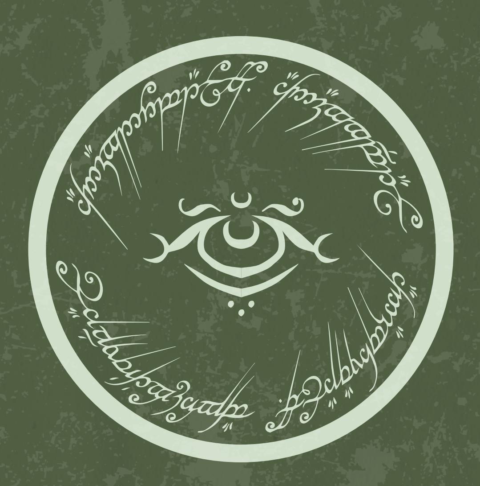

**the shire**

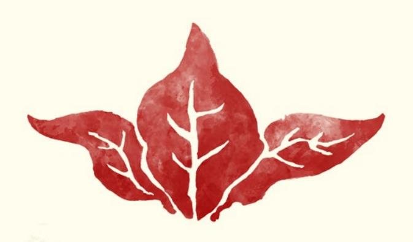

#### **LEAD WRITER**

James Michael Spahn

#### **ADDITIONAL WRITING**

Francesco Nepitello

#### **GAME DESIGNERS**

Francesco Nepitello and Marco Maggi

#### **ADDITIONAL RULES DEVELOPMENT**

Michele Garbuggio

**CONCEPT ART**

Alvaro Tapia

**COVER ART**

Martin Grip

#### **OTHER ART**

Alvaro Tapia, Martin Grip, Jan Pospíšil, Niklas Brandt, Henrik Rosenborg, Antonio De Luca, Federica Costantini, Melissa Spandri, Giuditta Betti

#### **GRAPHIC DESIGN**

Christian Granath, Dan Algstrand, Niklas Brandt

**MAPS**

Francesco Mattioli

**EDITORS**

John Marron, Jacob Rodgers

**PROJECT MANAGERS**

Martin Takaichi, Tomas Härenstam

**BRAND MANAGER**

Robert Hyde / Sophisticated Games

**EVENT MANAGER**

Anna Westerling

**PR MANAGER**

Boel Bermann

**STREAMING**

Doug Shute, Matthew Jowett

#### **SPECIAL THANKS TO**

Claudio Muraro and Umberto Pignatelli

#### **PLAYTESTING OF THE 2ND EDITION**

Adam Rawson, Agnes Rudbo, Amanda Stenback, Andreas Lundström, Anna Ave, Charlie Conley, Chiara Ave, Dan Price, Daniel Raab, Dennis Detwiller, Francisca Hoogenboom, Giuliano Nepitello, Kathleen Kiker, Kyle Wood, Lorenzo Perassi, Luca Donati, Maja Emilie Søgaard Widerberg, Maner Samuel, Marco Beltramino, Michael Kiker, Michela Baù, Peter Bergman, Peter Link, Ric Wagner, Stephen Buck, Steven Nguyen Dinh, Umberto Pignatelli, Vanessa Ratschinske.

**ISBN**

978-91-89143-48-7

*The One Ring, Middle-earth, and The Lord of the Rings and the characters, items, events, and places therein are trademarks or registered trademarks of the Saul Zaentz Company d/b/a Middle-earth Enterprises (SZC) and are used under license by Sophisticated Games Ltd. and their respective licensees. All rights reserved.*

*At once the western Hobbits fell in love with their new land, and they remained there, and soon passed once more out of the history of Men and of Elves.*

# a brief history of the shire

*Thus began the Shire-reckoning, for the year of the crossing of the Brandywine (as the Hobbits turned the name) became Year One of the Shire, and all later dates were reckoned from it.*

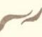

Though no one in the Shire recalls the time before they passed over the Bridge of Stonebows, Hobbits did not spring wholly into existence out of nothing. Ancient legends speak of a small, stout, river-folk that was driven out of the Anduin River valley and made their way west. There are suggestions that during their long, meandering journey, they spread into the North-realm of Men, perhaps making their way as far south as the region now known as Dunland. Tales forgotten by most and often considered unreliable claim that Hobbits once swore allegiance to that ancient North Kingdom, and took part on at least one occasion in feats of arms when evil things came out of dark places.

It was after taking up brief residence in the Chetwood and the area surrounding the village of Bree that a company of Hobbits petitioned the King of Men for a land of their own. They were granted his leave to occupy an area of verdant lands and build a realm for themselves that would ensure a bountiful life, hopefully free of danger and woe. Led by the brothers Marcho and Blanco, that company of Hobbits crossed the Brandywine, claiming as their own domain the land ranging from its banks to the Far Downs, some forty leagues west. They named that realm and all the surrounding land fifty leagues from north to south the Shire.

Originally ordered to maintain the great East-West Road and the Brandywine Bridge as a service to the King, the Shirefolk and their humble domain were soon left to their own devices. Even the title of Thain, granted to a single Hobbit of worth who spoke with the King's authority, rapidly became little more than an honorific among local residents. With the passing of only a handful of decades, few recognised the existence of the Shire to be of any importance. Few, except the Hobbits, of course. Free to tend to their own affairs, the denizens of the Shire prospered, and soon all the Hobbits of the wide world took up residence within its borders (save for those few still making their home in and around Bree).

This first generation of Shire-folk would suffer greatly at the hands of the Great Plague less than forty years after the foundation of the Shire (S.R. 36)\*, but though the terrible sickness caused the death of innumerable Hobbits and Men alike, the resilience of the Shire proved to be greater than that of the North Kingdom.

The days of the King were finally over in the year 375. The Shire became truly independent, though it mattered little to the world beyond its borders (save as a curiosity to the most inquisitive). Severed from larger history, Hobbits continued their lives in peace and plenty for countless generations. Villages and communities seemed to flourish endlessly, their precise dates of appearance largely unrecorded in any local chronology.

It is indeed due only to gossip and family history that we know that the Oldbucks, who could trace their lineage back to Bucca of the Marish, first Thain of the Shire, were so bold as to cross the Brandywine River going east and establish the community of Buckland, now home to Brandy Hall and the

\* To those outside the Shire their method of reckoning the passage of time may seem odd or even out of touch with the rest of Middle-earth. Quite so. Hobbits do not concern themselves with the affairs of Men or Elves, and it was in the 1601st year of the Third Age that they began living according to their own calendar. As such, outsiders can simply add 1600 to the Shire Reckoning year to get its equivalent in the Third Age. *—G*

great Brandybuck family. It was Brandy Hall's founder Gorhendad Oldbuck who changed his family name to Brandybuck, in honour of his new community in the same year of its founding, S.R. 740.

It was during this same period of prosperity that Tobold Hornblower would learn the art of the cultivation and smoking of pipe-weed, an enduring art that remains almost unique to the people of the Shire even unto this day. Isengrim Took II would begin construction of the Great Smials in Tuckborough in 1083, which still stands as the ancestral home of the Took family. It is also likely that in this time the Messenger Service (and later the Quick Post) were established to carry news between the ever-growing number of communities.

No Hobbit knows what prompted Golfimbul and his Goblin horde to descend from Mount Gram and cross the borders of the North Farthing. Instead, everyone from Michel Delving to Buckland knows that it was Bandobras "Bullroarer" Took of Long-Cleeve who led the Hobbitry-in-arms against the foul invader in the spring of the year 1147. Standing well over four feet tall and capable of riding a full-grown horse, Bullroarer Took charged screaming across the Greenfields and straight into the Goblin lines. With a single swing of his mighty club, he knocked the goblin warlord's head right off his shoulders. The head is said to have sailed straight over the entire enemy army, eventually landing in a rabbit hole. So terrifying was this

sight that the entire invading force fled. Oh, and the game of golf was invented in that very moment as well.

But the history of the Shire is not without its less violent troubles, and the first real threat to its existence came not from Goblins, but from famine. The winter of 1158 saw the beginning of the Long Winter. The ground froze hard and cold, with ice that came in the early days of November and did not leave until the last days of spring. Crops were destroyed by frost, and the delay in the turning of the season left planting to be done late, if indeed it could be done at all. The Days of Dearth that followed claimed the lives of many Hobbits for a full year, and it was long before joy and celebration returned to the Four Farthings. But perhaps it was this difficult time that reminded Hobbits that they were of hardy stock and strong hearts — for they endured.

 Minor horrors continued to plague the Shire, culminating in another terrible cold spell, known now as the Fell Winter of 1311. It was during this brutal season that the Brandywine River froze over, and that dire White Wolves came down out of the north and crossed into the Eastfarthing. On that terrible night the Horn-call of Buckland was sounded, and for the first time in almost two centuries, Hobbits took up arms to defend their own lands from invaders. Though victorious, the losses of that battle were grievous, and combined with the famine from an absent growing season, the people of the Shire suffered many deaths. But hope often comes when unlooked for, and it was in that time that Gandalf, the Grey Wizard, came to the aid of

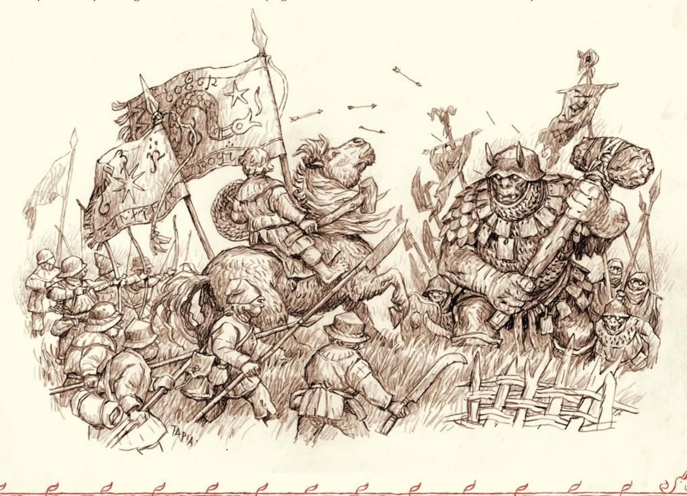

#### **THE ART OF SMOKING**

The habit to smoke the herb known as pipe-weed or leaf using pipes of wood or clay is a peculiar art that is almost certainly the invention of Hobbits. Adopted in recent times by travelling Dwarves and wandering Wizards, it is very popular among the inhabitants of Bree. Indeed, the idea to put the leaf into pipes for smoking can almost certainly be attributed to Bree-Hobbits.

The true mastery of that art began over two hundred years ago when Tobold Hornblower of Longbottom grew, dried, and smoked his first crop of Longbottom Leaf. Even to this day, though other flora can be smoked, no Hobbit, nor Dwarf, nor Man can argue that Longbottom is not the finest smoke in Middle-earth.

It is likely that Tobold, being rarely one to travel, brought the practice back into the Shire after one of his rare trips to Bree, though he never gave details as to what possessed him to bring the plant to the Southfarthing and cultivate it on the farmland he had claimed as his own. Though the details of its arrival will remain forever a mystery, Tobold was determined to grow this wonderful herb, and within a few generations it was found in the many variants now known to flourish throughout Longbottom and across the Shire.

Pipe-craft, like the art of smoking, is a matter of pride for many Hobbits of Longbottom and the Southfarthing, and their products range from stubby clay pipes smoked by simple farmers to ornate and intricately carved wooden pipes that are the treasured heirlooms of many of the wealthy families across the Shire. Indeed, it is not uncommon for several Hobbits to get together and engage in impromptu contests seeing who can blow the biggest smoke ring from one of these grand creations.

#### **BLOWING SMOKE RINGS**

Those who find themselves drawn into a smoke ring blowing contest (which most often occur inside inns or on summer nights in the Southfarthing), may make a **RID-DLE** roll, for the art of smoking is a delicate and subtle one. The character that achieves the highest quality of success is declared the winner, and ties are common, as Hobbits dispute the features of one ring or another in the seconds before it disperses. Tradition holds that the winner gives as a gift to those who have lost a pouch of their finest tobacco, so that they might further study the art. However, the winner is still held in high regard, and can expect a filled tankard and a free meal at the losers' table within the next few days.

many. It is believed by some that this kindness may have saved the Shire all together, though few Hobbits living now would make such a claim, considering that Gandalf is now seen as quite the disturber of the peace (stories also abound concerning how Gandalf was helped by a group of Men, who returned to the wilds when their task was completed).

In the decades following those dark days, peace and comfort became once again the rule in the Shire. The largest trouble to strike this green country in recent years was the disappearance and surprising return of Bilbo Baggins, of Bag End. Once a respectable Hobbit, he went off on some adventure with a troupe of Dwarves and the mischievous Wizard Gandalf, only to return, nearly a decade ago now, astride a pony laden with riches, according to rumour. Since that day, Bilbo was officially considered 'cracked', and all sorts of trouble was attributed to him: Dwarves started to be seen more often on the great East-West Road, and strange, hooded wanderers were sighted by more than one bounder. And wouldn't you know it — since then that trouble maker Gandalf seems to appear and disappear about the Shire whenever he pleases! No doubt coaxing tweens and Tooks alike into all manner of adventure as he did that poor, mad Baggins of Bag End.

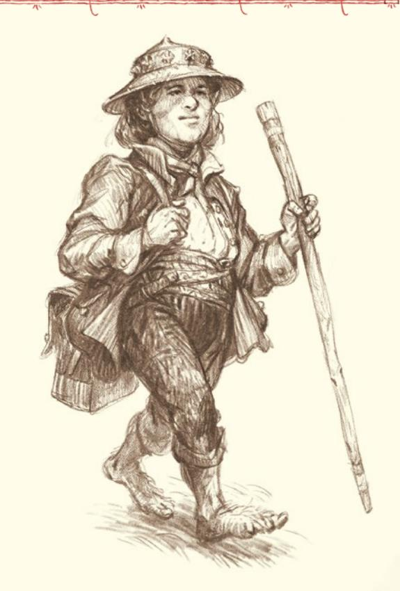

# **the tale of years of the shire**

Described below in brief are important events in the history of the Shire, notating both the dates as they are recounted in the calendar of the Shire Reckoning and the years of the Third Age as recognised by those outside its borders.

- ♦ **1 S.R. / 1601 T.A.** Marcho and Blanco establish the Shire in the lands between the Far Downs and the Brandywine River, with the blessing of the King of the North Kingdom.
- ♦ **36 S.R. / 1636 T.A.** The Great Plague sweeps across the Shire and many Hobbits die of the pestilence.
- ♦ **375 S.R. / 1975 T.A.** A company of Hobbit archers travels to aid the King. They never return. With the fall of the North Kingdom the Shire effectively becomes an independent realm.
- ♦ **740 S.R. / 2340 T.A.** Gorhendad Oldbuck abdicates the Thainship of the Shire and travels east to establish a new settlement on the far banks of the Brandywine River, where he takes the family name of Brandybuck and begins construction of Brandy Hall.
- ♦ **1070 S.R. / 2670 T.A.** Tobold Hornblower cultivates the first recorded crop of pipe-weed.
- ♦ **1083 S.R. / 2683 T.A.** Isengrim Took II begins excavating the Great Smials, ancestral home of the Took family.
- ♦ **1147 S.R. / 2747 T.A.** The Battle of the Greenfields. Bandobras "Bullroarer" Took defeats the Goblin horde

- of Golfimbul and routs his invading army that had come down from Mount Gram.
- ♦ **1158–1160 S.R. / 2758–2760 T.A.** The Long Winter. A brutal winter destroys crops, and snow covers the Shire from November through March. The famine, sickness, and death that follow for over a year become known as the Days of Dearth.
- ♦ **1311–1312 S.R./ 2911–2912 T.A.** The Fell Winter. A long, hard winter freezes the Brandywine River solid. White wolves cross its waters and are driven back by Hobbit defenders after the Horn-call of Buckland is sounded. Famine again briefly grips the Shire through the season, and into the spring. Gandalf the Grey comes to the aid of the Hobbits, and saves many lives with the help of mysterious wanderers.
- ♦ **1341 S.R. / 2941 T.A.** Bilbo Baggins of Bag End departs the Shire in the company of Gandalf the Grey and thirteen Dwarves.
- ♦ **1342 S.R. / 2942 T.A.** Bilbo Baggins returns from his travels in foreign parts, proves he is very much alive, and reclaims ownership of his home as it is being auctioned on the presumption of his death. He retires, becoming a local oddity, and living off the wealth he acquired in far off lands.
- ♦ **1357 S.R. / 2957 T.A.** Cotman Bunce resigns. Pott Whitfoot elected Mayor of Michel Delving.
- ♦ **1360 S.R. / 2960 T.A.** Current year.

# **THE HOBBITRY-IN-ARMS**

Among the notable organisations established within the Shire are its oft-forgotten martial institutions. The first of these is the Hobbitry-in-arms, which acts as a militia to defend the Shire in times of dire need. It exists now as little more than a ceremonial company overseen by the Thain, who serves as its captain.

As to day-to-day matters, these are instead tended to by the Watch. The Watch consists of twelve Shirriffs, with three assigned to each of the four farthings, and by a variable number of Bounders. Shirriffs are easily identifiable by the single feather in their cap, and are led by the First Shirriff — an honorific bestowed upon the Mayor of Michel Delving. But little trouble occurs within the borders of the Shire, and like the Hobbitry-in-arms, being a Shirriff is little more than a ceremonial position in all but the darkest of times. The most numerous element

of the Watch, and by far the busiest, is the Bounders, tasked with 'beating the bounds' — that is, seeing that outsiders and mischief makers don't cross into the Shire. Tasked with reporting any trouble they encounter to the Shirriffs, what they do is little more than nosing about the Shire, dipping into local inns to catch up on the most recent gossip, chasing naughty Hobbit children from a farmer's crop, or helping retrieve the occasional wayward cat from a tree.

In recent years, as Dwarves and other travellers have begun to enter the Shire more and more, the job of the Bounders has become a little livelier, much to their consternation. Some blame the coming of the Wizard Gandalf, while more than a few consider Bilbo Baggins to be responsible for bringing ill-fortune to the Shire, along with his piles of gold and jewels that he has stuffed away in Bag End.

# **families and culture**

Since the fall of the North King, the people of the Shire have lived in their own way for generations. To outsiders, Hobbits are seen as a simple or even backwards folk, with little concern for affairs that are not their own. While it is an absolute certainty that the latter is a statement of fact, the former is a falsehood perpetuated only by fools and the unwise.

At first glance, a casual observer could claim that food and drink are chief among a Hobbit's concerns, and that wouldn't be too far off the mark. But the real centerpiece of the life of each individual Hobbit, and the Shire as a whole, is the family. Very nearly every Hobbit of the Shire can place everyone they meet somewhere along their family line, from second cousins twice removed to great-great-great grandparents — and they can do so from memory.

Hobbit families gossip and spat, argue and snipe, but the bonds of kinship are never so far from their hearts that they forget both where and whom they came from. No one can help but be filled with great pride when recalling the notable deeds of an ancestor, often as if those actions were their own. Unfortunately, no one ever forgives any insult or damage suffered either, if amends are not made, and petty rivalries can last generations.

This love of lineage means that more than a few personalities are recorded forever in the collective memories of all the people of the Shire, starting with the founders Marcho and Blanco. Their names are known and celebrated by every Shire-Hobbit, even though their family affiliation has been lost to time (it is the secret hope of every Hobbit patriarch and matriarch to discover proof of a common heritage, and attempts have been made by more than a few Tooks or Brandybucks over the years — to no appreciable results, so far). Other notable ancestors include the unknown members of the company of archers that centuries ago went north to aid the King, never to return. While their family names are lost like those of Marcho and Blanco, there is scarcely a mantelpiece in the Northfarthing that doesn't sport some rusty knife blade, pitted arrow-head, or rotting feathered cap held as proof of kinship.

The average Hobbit's love for genealogical lore is not limited to ancient history. It is indeed only thanks to this passion that most Hobbits can orient themselves in the complex web of relations between modern families like the Took, Baggins, Brandybuck, Hornblower, Boffin, and Bolger — just to name a few. As these families intermarried with one another, it did not take long before a great many Hobbits were claiming kinship with folk from across the Shire who would otherwise be little more than strangers. Because of this, there is a sense of fellowship between Hobbits not found in Men, Dwarves, or any of the other Free People of Middle-earth.

Perhaps this is the root of the Hobbits' love of food, drink, and leisure. All these things are brought to their fullest joy when shared with loved ones, and the more with whom to share, the greater the joy. Parties celebrating even the slightest occasion are common in the Shire, as they are excellent excuses to gather in good company, and six meals a day seems perfectly appropriate when one endeavours not to dine alone.

The most common of these celebrations is, of course, the Birthday Party. In a custom that would only seem strange to one from outside the Shire, Hobbits accompany the tradition of feasting, drinking, and dancing with the giving of gifts, not to the Hobbit celebrating their birth, but rather to their guests. Mathoms, serving as tokens of esteem and affection, are given to those near and dear to a Hobbit's heart on their birthday. Outside the Shire, in the world of Men, the opposite is done — as if a reward is deserved simply for being born. A strange notion indeed.

#### **ALL IN A HARD DAY'S WORK**

This brings us to the next misconception regarding Hobbits. That they are lazy and overly concerned with leisure. Hobbits enjoy a fine afternoon fishing, or a good game of golf, to be sure, and tweens (like any young rascals) will often avoid their chores in favour of lighter pursuits. But one does not master the fine art of baking, cooking, preserving, cultivating food, raising livestock, and tending the garden without wiping a bit of sweat from the brow now and again. In fact, no other people of Middle-earth were so industrious as to discover the secrets of herb-lore necessary to grow and prepare pipeweed. The art of pipe-smoking is truly the art of the Hobbit, although it has since been adopted by Men, Dwarves, and even a Wizard. Instead, many Hobbits view this work as not a source of toil or drudgery, but simple activities necessary to live a good life among their people. As such, misery is rarely found in these tasks.

Instead, sorrow finds the heart of even the merriest of Hobbits when tragedy strikes. To be sure, a burnt pie or trout that slipped the hook is a source of consternation, but the losses that cut to the root are those things that were toiled for over generations or cannot be recovered. To see a great tree felled foolishly, or lose a loved one before they have had a long and joyful life, are among the greatest of tragedies to a Hobbit. These are the things that cannot be replaced.

### **NO BUSINESS OF OURS**

As we have seen already, Hobbits have little concern for the affairs and doings of those beyond their borders. Dwarves, in their constant search for riches above all else, are often

seen as dangerous or too greedy, and the world of Men is large, loud, and uncouth. Indeed, the last time Hobbits got involved in the affairs of Men many lives were lost to no avail. As for Elves, they are so far beyond a Hobbit's understanding as to be nigh indecipherable — no matter how wonderful the stories make them out to be. So, for most Hobbits, it is best to keep to one's own affairs, so as to keep a level head upon your shoulders, unclouded by the fancies of outsiders.

That is not to say that all Hobbits shun what lays beyond the Brandywine. Nor that visitors never come into their lands. Since the Fell Winter of 1311 and 1312, a regular interloper has made his presence known to Shire-folk. Gandalf the Grey, who is by all accounts, a Wizard, seems to hold Hobbits as a merry curiosity. In spite of his glorious fireworks and fanciful tales, he has a reputation as a troublemaker and his encouragement has led more than one foolish young Hobbit to disappear, never to return. He seems to have a particular fondness for the Took clan and its cousins. In recent years, he has even been held responsible for driving the previously predictable and respectable Bilbo Baggins quite mad, only to return him to the Shire with unlikely stories and foreign gold. It is even feared that his appearance during the Fell Winter may have drawn the attention of Men, as rumours have persisted since that time of Big Folk, hooded and cloaked, being seen near Sarn Ford and the North Moors.

#### **AS FIERCE AS A DRAGON IN A PINCH**

If nothing else, Hobbits continue to be underestimated by the other Free Folk, a fact that would be of great comfort to most inhabitants of the Shire. Call them fat and simple, but we know that history marks a fair few to be fierce and doughty. Like a good meal, they must be long stirred (often over fierce heat), before the truth of who they genuinely are is revealed and set to table. Marcho and Blanco had the courage to travel west and found the Shire. The nameless Hobbit-archers travelled to foreign parts to fight in a foreign war. Gorhendad Oldbuck dared to live in the shadow of the Old Forest, as do his descendants today. Bullroarer Took led his brave fellows in battle when fell Goblins dared to invade his beloved Shire. Even in this current generation, that tenacity remains. The Horn-call of Buckland brought Hobbits to arms against the White Wolves. And Bilbo Baggins, for all his strangeness, ventured beyond the horizon and over the edge of the wild only to return, and by some accounts he was made richer for it in more than gold and silver.

As to what the coming days will bring for the people of the Shire, none can say. What is known is that, as before, so shall it ever be in the land between the Far Downs and the Brandywine. A fierce love of all that is simple and good will remain strong and steadfast as the Hobbits of the Shire stand together with kin and countrymen against whatever threatens their traditions. But until called to such duty, they shall celebrate this simple life they have made for one another.

# **GANDALF THE GREY**

Andreas Danielsson (Order #34277159)

To the great discomfort of many of the more traditional Hobbits, and to the great joy of Tooks, tweens, and young children, the Wizard Gandalf the Grey is known to arrive in the Shire on seemingly random occasions. Whether this is a quiet and secret trip to see Bilbo Baggins, or a visit heralded by Hobbit children crying for fireworks at the sight of his cart and pony, the strange figure has become a signal of mischief to come within the confines of the Four Farthings.

What his errands are, and when he will arrive remains his own business, though certainly he only comes to the Shire to stir up trouble and disturb the peace. Most often, his visits take him to Bag End or into Tookland, but his reasons for visiting remain a mystery. As often as not, some young Hobbit disappears for a week or two after Gandalf has gone on to other business — or at least that's the claim of local gossips and busybodies.

But Gandalf is not without his admirers, particularly when it comes to the matter of his fireworks. These most excellent creations have become the talk of the Shire since when the Old Took started to have them at his Midsummer-eve Parties, and every Hobbit, whether they will admit it or not, secretly hopes the wandering Wizard will grace their celebrations with his fantastic displays.

# the geography of the shire

*Forty leagues it stretched from the Far Downs to the Brandywine Bridge, and fifty from the northern moors to the marshes in the south.*

As is known to any Hobbit of good sense, the Shire comprises the territories known as the Four Farthings, which are named the Northfarthing, the Eastfarthing, the Southfarthing, and the Westfarthing. This covers the whole of the land originally granted to its residents by the King, and it was only after old Gorhendad Oldbuck grew too cross and his family to be confined that Hobbits moved beyond these traditional borders. Pushing beyond the Marish and over the Brandywine, he founded Buckland between the river's eastern shore and the edges of the Old Forest. It has, since its founding in S.R. 740, been the primary domain of his people and their innumerable relations: the Brandybucks.

Even with the establishment of Buckland, the Shire has grown but little over the centuries, and still holds for the most part to its original bounds between the Far Downs in the west and the Brandywine River in the east. In fact, more than a few folk on the west side of the river regard Bucklanders as little better than the far-off Bree-Hobbits, with their fancy for boats. But we shall come to that in time.

Meanwhile, far beyond Overhill, on the edges of Oatbarton, the North Moors see the first and heaviest snows of the winter each year, and the warm summer sun allows the land to flourish all the way down to Longbottom. Though Buckland is the only outlier beyond these formal borders, many Hobbits that dwell in the smaller communities along them, such as the miners of Scary and the fishermen of Deephallow, have a reputation for being out of sorts, even if their status as true Hobbits of the Shire is beyond question.

# **the three-farthing stone**

To properly relate a list of the places of importance within the Shire, it is only appropriate to begin at its very heart, and then explore each of these domains in turn. Whether it was erected by the high king at Norbury, by the brothers Marcho and Blanco, or some other thoughtful Hobbit of surpassing good sense, the Three-Farthing Stone stands in the middle of the Shire.

Tall as two Hobbits, and worn little by age or time, this column serves to mark where the borders of the Westfarthing, Eastfarthing, and Southfarthing meet. Indeed, it is easily visible to any Hobbit or the rare outsider travelling on the East-West Road. Though it serves no formal purpose beyond indicating the true and proper centre of the Shire for all to see, the Stone is held in great esteem by all residents of the Shire — save for naughty Hobbit-children roughly playing "King of the Stone" as they attempt to best one another by seeing who can scramble up its slick, rocky sides the fastest (before inevitably tumbling down or being knocked about by their playmates).

More than one such rascal's name has been heard all the way in Bywater, carried nearly five miles on a northwesterly wind, as an angry gaffer or gammer bids them stop such foolishness before they rightly hurt themselves — or worse, knock down the stone. But through all the generations of the Shire-folk, the Three-Farthing Stone has endured.

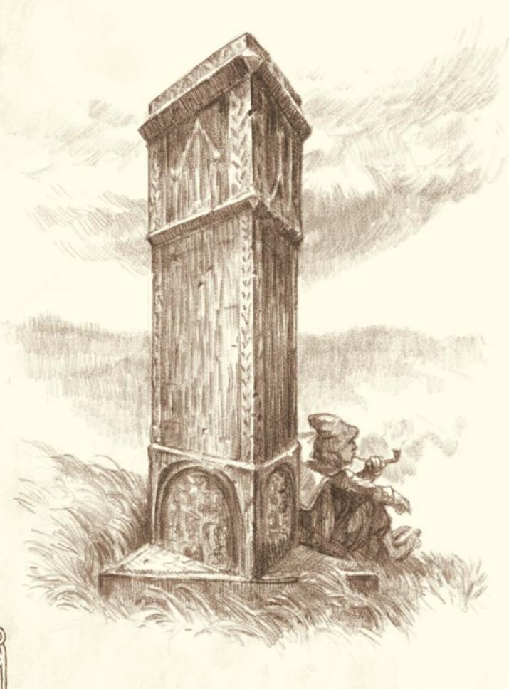

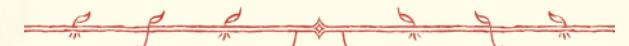

#### **A NIGHT AT THE STONE**

Recently, strange white shadows have been drifting around the ancient Three-Farthing Stone at night. Stories of ghosts, mournful spirits, or even a magical curse have begun to be whispered at the tables of the Stone's Throw, the inn closest to the ancient landmark, and now many are afraid to pass near it after sundown. It would be a kindness, some locals say, if a few brave Hobbits spent the whole night near the stone, to dispel the probably baseless rumours.

The small inn stands just a few miles east of the Three Farthing Stone, and is owned by Thomas and Gilda Bunce. They do a brisk business thanks to this mysterious tale. In fact, many west-bound travellers prefer to stop and sleep here when the stars begin to appear. This is no accident… Thomas and Gilda are responsible for spreading the rumours themselves, and from time to time, they deck themselves in white sheets, and wander for hours at night, or bid their mischievous children do it in their stead.

# **the water**

The river running across the Shire from its source in the Hills of Evendim to where it flows into the Brandywine is simply called "the Water" by the Hobbits of the Four Farthings. Little more than a slow-rushing stream where it spreads into the Rushock bog, it eventually resumes its eastward course and runs parallel to the road connecting Little Delving and Nobottle to Hobbiton. From there, it joins with another watercourse from the north to create the Bywater Pool before continuing on, along the East Road all the way to the Brandywine. Passing beyond the borders of the Westfarthing, the Water continues to flow east, its meandering curves dampening the soil near Frogmorton and serving as the heart of Budgeford with its ruling Bolger family.

Good fishing can be found along its banks at very nearly every point, save where it narrows in the Rushock, and it's not uncommon to find a Hobbit angling for a fresh catch or napping on the bank while they hope for a good supper.

# **the east road**

If the Three-Farthing Stone is the heart of the Shire, then the East Road acts as its feet. Very nearly every Hobbit of the Shire has walked this pathway at some point in their lives, and legends say that it runs as far west as the Dwarven realm of the Blue Mountains and all the way east to Bree and beyond that to the very edge of the Wild (few, if any, Hobbits have ever tested this theory…). To most it is simply a wide, wellkept thoroughfare that leads travellers to tea times in Budgeford or to a party in Michel Delving. As far as the Shire-folk are concerned, the East Road might as well begin at the door of the Town Hole in Michel Delving and end at the Brandywine Bridge.

On rare occasions, some foolish young Hobbit will get it into their head to walk its entire length. These boasts rarely amount to more than that, for such an endeavour would encompass walking for about forty leagues. Still, it is not an insurmountable task, and the East Road itself brings such a journey within the realm of possibility for enterprising tweens and adventurous Bucklanders.

Given that most Hobbits like to maintain a leisurely stroll, and regularly enjoy a walking party now and again, they're not likely to achieve more than a dozen miles or so in a day, unless they set a brisk pace. Even without taking regular breaks for tea or a nap, a trek from one end of the Shire to the other on foot is likely to take close to a week, though given the ease with which a Hobbit can be distracted by a fine meal, afternoon rest, or a stop off at the local inn, such a trip is likely to take closer to ten days or more.

Though the land does indeed consist of mainly green rolling hills, as one draws closer to the Brandywine, it flattens considerably, and an already easy walk becomes all the more so due to the well-maintained road. Fortunately, there are few dangers in the Shire for even the most adventurous Hobbit, but those who are foolish enough to camp near the Bindbole Wood or other untamed region may draw the attention of nosy wildlife intent on sniffing out the delicacies from their travel packs.

No sight-seeing expedition from one end of the East Road to the other would be complete without several stops at the many fine inns across the Shire. Many travellers make it into a sort of game to stop at every tavern along the way as they cross the Four Farthings, which can delay even the fastest rover. The further east one is, the more such local watering holes one will find: The Golden Perch in Stock, the Floating Log in Frogmorton, the Stone's Throw near the Three Farthing Stone, and of course, the Green Dragon in Bywater. But beyond Waymeet and its Walking Party Inn, there are only a few noteworthy taverns. Michel Delving hosts no less than three fine establishments of its own, though the long trek across the Far Downs will leave most travellers with a powerful thirst before they reach Greenholm and its unusual inn, the West End.

# **HOBBIT WALKS**

No road-weary Man, doughty Dwarf, or wandering Elf would consider travelling through the Shire as anything more than a pleasant country stroll. It has no real natural dangers and its people are, for the most part, courteous. The greatest trouble a foreigner may face while visiting the Shire, beyond a strange look and a few pointed questions, is found at the bottom of a tankard or on a dinner plate, given the abundance of inns that fill the little land.

While not ones to push themselves or maintain a steady pace at the cost of pausing for a meal, Hobbits crossing the Shire mostly stick to familiar roads and familiar lands, but there are some dangers if a curious tween or errant walking party strays into more untamed lands, even within its borders.

When a Company of Hobbits is travelling across the Shire, the Loremaster must roll on the table below once, using a Feat die (twice if the journey is particularly long — 50 miles or more). Each entry provokes a gain of Fatigue points, that each traveller can reduce with a roll of **TRAVEL**.

A success reduces the total Fatigue of a Playerhero by 1, plus 1 point for each Success icon ( ).

Any remaining Fatigue is recorded on the character sheets of the affected Hobbit, and counts as additional points of Load. They will get rid of it at the rate of 1 point of Fatigue for each following Prolonged Rest they take.

**FATIGUE POINTS GAINED**

# SHIRE JOURNEY EVENTS TABLE

| FEAT DIE             | EVENT          | DESCRIPTION                                                                        | SUMMER AND SPRING | WINTER AND AUTUMN |
|----------------------|----------------|------------------------------------------------------------------------------------|----------------------|----------------------|
| Image: [Eye symbol]  | Trouble!       | Chased by dogs, wading through stick bushes and hedgerows, etc.                 | 4                    | 5                    |
| 1–4                  | Delay          | Spent too much time at the inn, took a wrong turn, bad weather, etc.            | 3                    | 4                    |
| 5–8                  | A Quiet Walk   | A pleasant stroll with nothing adventurous                                         | 2                    | 3                    |
| 9–10                 | Short Cut      | The journey took less time than expected                                           | 1                    | 2                    |
| Image: [Rune symbol] | Chance-meeting | Wandering Elves sighted, guests of travel- ling Dwarves, wandering Wizard, etc. | —                    | 1                    |

These are a few examples of the type of trouble that might be encountered on the road. The Loremaster is encouraged to develop and expand the list of things that may go wrong.

- ♦ **FOG ON THE EAST ROAD:** One night, a heavy fog rolls down from the North Moors and blankets the land, and growling noises and hoots can be heard from beyond the edge of sight. The Hobbits must pluck up their courage and make a **VALOUR** roll, or be unable to benefit from a Prolonged Rest that night and gain 1 Shadow, as those ill-sounding creatures and glowing eyes in the fog linger in their minds for hours to come.
- ♦ **CHASED UP A TREE:** A local farmer's guard dog runs off the property, and sets out to chase the Hobbit travellers, believing them to be interlopers. If a **HUNT-ING** roll is failed, then they are unable to calm the dog, and must spend the rest of the afternoon stuck uncomfortably up a tree to avoid his bites. They gain 2 additional points of Fatigue each from hours of being crammed awkwardly in the boughs of a pine.
- ♦ **UNEXPECTED DRINKING COMPANION:** While resting one night at an inn, the characters find themselves drawn into a lively conversation and they imbibe more than a few mugs of finely brewed bitters. If they're not watchful of their own actions, and fail a **WISDOM** roll, they wake up the next morning feeling *Weary* for the following day.

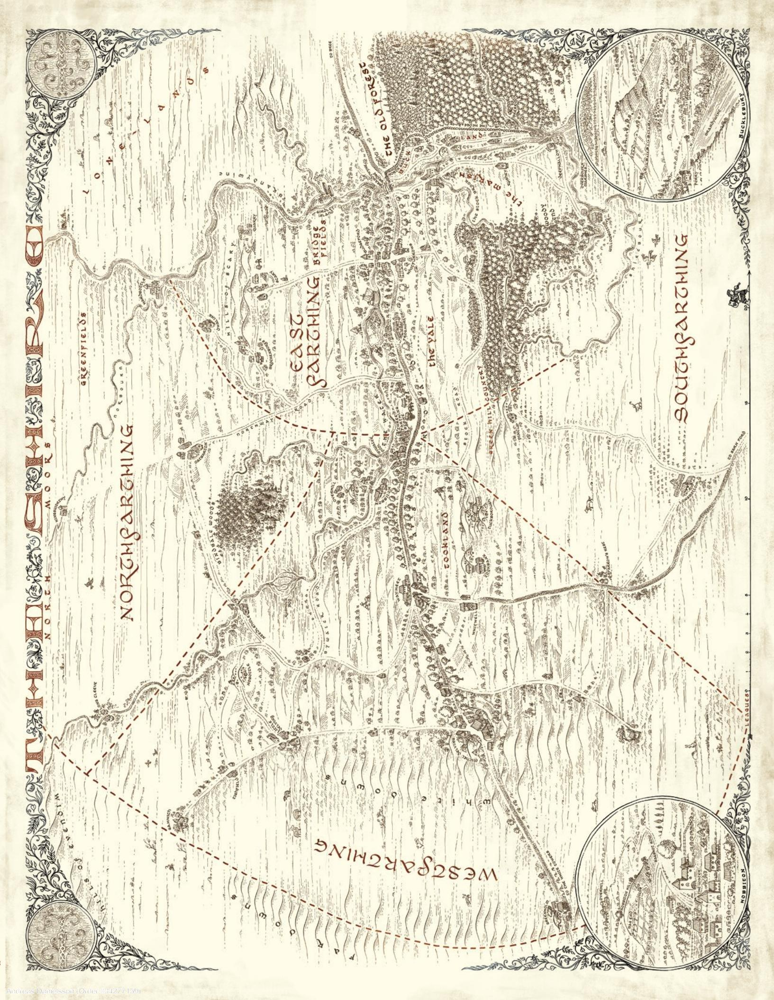

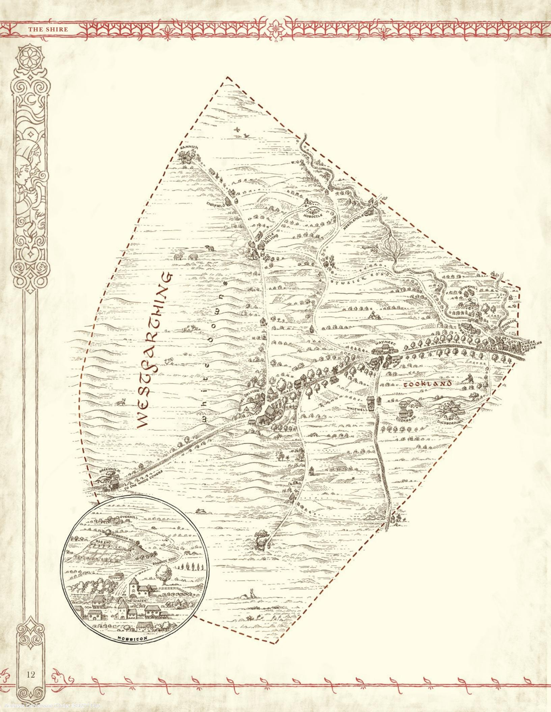

# the westfarthing

*… in the Westfarthing, especially in the country round Hobbiton Hill, there grew up a custom of making holiday and dancing in the Party Field, when weather permitted …*

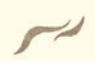

Considered by many, especially its own residents, the be the most important of the Four Farthings of the Shire — Buckland being not counted at all, the Westfarthing runs west to east from the Far Downs to the Three-Farthing Stone, and north to south from beyond Little Delving to deep into the heart of Tookland. A land dominated by soft, rolling countryside, it is home to many of the more well-known families of the Shire, including the Tooks of Tookland, where the Thain resides, and the Whitfoots of Michel Delving, where mayor Pott Whitfoot lives.

## **BYWATER**

If you take the road from Hobbiton going south along the Water, you'll soon come to the village of Bywater and its wide, grey pool. The first building you encounter is The Green Dragon Inn. A popular meeting-place for the inhabitants of both Hobbiton and Bywater, the Green Dragon saw its reputation besmirched when it was invaded by Gandalf and a company of Dwarves on a spring morning some twenty years ago. Indeed, the inn was the last place where Bilbo Baggins was seen before he disappeared. Ruthie Overwater, a local gossip, claims to have witnessed the whole affair when she was barely out of her tweens — her tale tells how young Bilbo was hauled away in a sack down the East Road by the Wizard himself! But the inn's excellent ale and sweet mead (not to mention the fine fried fish and potatoes served up right) have done quite a bit to restore the Green Dragon to proper status in the eyes of the local community.

In Bywater itself, many houses gather around the Pool. A long line of proper Hobbit-holes dots its northern bank, all fronted by small gardens running down to the water's edge. A pleasant tree-lined avenue forms the section of the road where it borders the water, giving it the name of Pool Side.

From Bywater, one can take the South Lane, leading to land held by respectable farmers like Holman Cotton, who moved to these parts with his two sons, soon after his wife passed, and has set up a right respectable plot of land, or Old Noakes, who keeps a regular table at the Ivy Bush — when he's not found at the Green Dragon Inn. Old Noakes and family keep orderly hives of honey bees, allowing them to provide the Green Dragon with the stock of honey they require to craft mead, to trade with the locals, or to give away as birthday presents to deserving friends and relatives.

# **gamwich and tighfield**

Though little used, the cart-road that runs out of Little Delving heading into the northern corner of the Shire leads to the oft forgotten villages of Gamwich and Tighfield. There are no Hobbit-holes here, instead, small wooden houses serve as farms where locals tend to fields of swaying flax that dance in the summer breeze.

Set between the two communities is the great rope-walk, a long and narrow stone building, likely the only one of its size and type in the Shire — where strands of fiber are spun and woven together to make the finest rope in the region. Here works Andwise 'Andy' Roper, the most skilful rope-maker in the Shire, the heir of a long tradition going back at least three generations. While Hobbits are certainly willing to labour at many tasks, some find rope-making to be akin to Dwarf-work, and in recent years, many families from both villages have considered migrating to less remote spots in the Westfarthing (among them, Andy's brother Hamfast, who has taken on gardening as his trade and has moved to Hobbiton).

## **THEFT AT THE ROPE FACTORY**

A bit of chaos has come to Tighfield. A mob of angry Hobbits led by Andy Roper surrounds a small, isolated farm not far from the rope-walk, waving clubs, pitchforks, and torches, and it looks as though they could set the farmhouse ablaze at any moment. But their consternation is easily understood: three Dwarves have barricaded themselves inside the besieged farmhouse after becoming the prime suspects in a brazen rope theft from the factory! The Tighfield locals are angry after their polite offer of a tour (which they were only offering as a matter of courtesy and never expected to be accepted) has been repaid with larceny!

The Dwarves, led by Ergi Broadbeam, have denied all charges, and replied to insults with stones thrown from windows and arrows shot through half-open doors. Poor Bess, Andy's mule, was even wounded in the crossfire! Birba Muggins, the owner of the farm that housed them, and her son Bobbin, escaped just before the violence began. They heartily support forcing out the Dwarvish scoundrels at any cost even if it means seeing their own home burnt to the ground. Dwarves are horrid people, Birba claims, and deserve what's coming to them.

Bree Bullies A pair of Bree-Hobbit merchants have stopped for a pint while passing through the

roll, a brawl may be imminent.

Shire, and have had a bit too much. Irritated by a poor sale recently, they've decided to try to pick a fight! Unless they can be calmed down with a **PERSUADE** or **COURTESY**

If the Player-heroes get involved in this mess, they must decide whether they want to help the Hobbits, the Dwarves, or if they want to broker a truce between the two parties. Resolutions aimed at harming the Dwarves see the full and enthusiastic support of Bobbin and his mother. Conversely, any offer of attempting to negotiate with Ergi and the Dwarves is met with strong resistance from them.

Level heads can prevail with a few pointed questions and a short investigation. Should the Player-heroes attempt such a thing, they may learn several details that offer insight into the current troubles:

- ♦ The Dwarves are angry, very offended, and ready to fight. They are also completely innocent. The theft was in fact committed by Bobbin, as directed by his mother, with the Dwarves serving as scapegoats for the crime. (The ropes are hidden in a cellar under the Muggins farmhouse).
- ♦ If the Player-heroes question locals not participating in the chaos, they learn that, eight years ago, Birba's husband Golfo kindly offered to accompany some Dwarves on a journey to Greenholm, near the Shire's western border. Sadly, he never returned from that journey: he got lost on the way back somewhere in the Far Downs, and disappeared in the wild. His body was never found, but Birba is convinced that the Dwarves murdered him in his sleep and stole his few possessions. Years have passed, and an overwhelming grief has turned to hatred towards all Dwarves in the hearts of Birba and Bobbin. This hatred spurred them to action when Ergi came into town, leading them to believe he was the murderer of their beloved father and husband.

**ATTRIBUTE LEVEL**

**5**

**DWARVEN 'SCOUNDRELS'** Secretive, Wilful

Bow 2 (3/14, Pierce)

**ENDURANCE 28**

**MIGHT RESOLVE**

**5**

**PARRY +2**

**COMBAT PROFICIENCIES:** Cudgel 2 (3/12),

**1**

**FELL ABILITIES:** *Fierce Folk.* Spend 1 Resolve point to make an attack roll *Favoured*.

# **greenholm**

More than a true village, Greenholm is a collection of modest houses and a few humble Hobbit-holes dug in the last hills upon the western border of the Shire, where the East Road becomes just a trail and then disappears. Few bounders go all the way to Greenholm, out of Michel Delving, and they don't have much to say about the place, when they say anything at all. By those rare accounts, the folk in Greenholm are strange, but kind and determined, and don't seem to need much assistance from the Watch to look after themselves and the borders.

The most prominent family in Greenholm, and the source of the locals' unusual resolve, is that of Folcred and his brothers, a small clan of hunters who are said to have regular contact with Dwarves out of the Blue Mountains, and to be more familiar with Elves than is considered proper. More than one witness is said to have seen them hunting in the hills along with strange, hooded individuals with an 'elvish' look.

# **THE FAIRIES OF THE FAR DOWNS**

The Far Downs beyond Greenholm are travelled by few Hobbits. There, a heavy fog clinging to the green grasses often rises with the moon and burns away with the new sun. The Hobbits of Greenholm speak of strange little creatures that conceal themselves in this mist, enchanting travellers that dare step off the East Road and into the gloom. These fairies, as they call them, hope to snatch wayward Hobbits to take as their spouses. Those so enchanted are returned to the edges of the Shire after the mist burns away, with dreamlike, fragmented memories of a grand wedding and great revelry. Marked by the people of Greenholm and the rest of the Shire as having "taken a fairy wife," the common belief is that encounters with these curious creatures leaves a strain of madness in the blood that lasts for generations.

## **NEW HOBBIT DISTINCTIVE FEATURE: FAIRY-BLOOD**

One of your ancestors is said to have "taken a fairy wife". Whether this is true or not, a vein of rebellious foolishness runs in your family and manifests in you as a deep streak of mischievousness, often leading you to cause trouble for its own sake.

# **hobbiton**

Before the Master of Bag End went running off into the blue and turned back up again about twenty years ago, earning his reputation as an 'adventurer', the village of Hobbiton was a quiet, untroubled place. Possibly the oldest of all settlements of the Shire, it lies placidly against the southern side of the Hill, and the currents of the Water run straight through its middle. Where the road crosses the Water over a stone bridge is the most prominent building of the area, the old water-mill, property of Mr. Sandyman, rising next to the Old Grange. Together, those two establishments have brought respectability (along with bread and beer) to Hobbiton for generations.

Most of the residents of Hobbiton make their homes in traditional *smials*, or Hobbit-holes, within sight of the Old Grange and Sandyman's mill, with more than a few taking up residence in the neighbourhood of Underhill. Still, some of the notable families still have homes of wood or stone near the banks of the Water where they fish or keep small farms.

Families from both Hobbiton and nearby Bywater often travel along the road connecting the two villages, to meet their neighbours and keep up with the latest news — locals have yet to agree upon where the road stops being the 'Hobbiton road' and where it becomes the 'Bywater road' instead. It's quite common for folk from both communities to sit down for a pint over dinner or supper at the Ivy Bush. More than one Hobbit has been drawn by the prospect of a fresh serving of Boffin's Crock and a mug of ale, but as often as not they find themselves staying for the local gossip and tale-telling that inevitably comes when one of the foolish young Hobbits (or cantankerous gaffers) starts to spin a yarn. Often these exchanges grow into competitions of balderdash, where the rules are known to all, but spoken by none.

## **THE HILL**

While formally recorded on the maps of the Mathom-House as Hobbiton Hill, it is rightfully called simply The Hill by everyone in the Shire. Rising north of the Water where it crosses the town, its top can be seen for miles around in all directions. Halfway up its slope, the long lane of Bagshot Row runs, serving as home to such prominent families of the Shire as the Twofoots and Greenhands — all of whom maintain root gardens and flower boxes to brighten the lane from the first thaw of spring to the inevitable frosts of winter. The laughter of Hobbit children at play can be heard echoing down the Hill all the way into Hobbiton.

## **BAG END**

Nearly one hundred years ago, when Bungo Baggins brought his new Took wife out of Tookland to live among sensible folk, he built for her a home of the type to which she was

#### **HAMFAST GAMGEE**

Known to every Hobbit around the Hill, Hamfast Gamgee is a simple, proper Hobbit that has tended the gardens at Bag End as an apprentice to Holman Greenhand for nigh on twenty years now. It was Hamfast and Holman that kept Bilbo's garden in order for over a year in spite of his absence. Originally from Tighfield, and a younger brother to Andwise Roper, Hamfast moved to Hobbiton on invitation from Holman, a distant relative, who knew that the young Hamfast didn't intend to continue the family tradition of rope-making.

With the master gardener slowly surrendering to old age, Hamfast will soon be taking on the role of head gardener at Bag End sooner rather than later. He has developed a fierce loyalty to Master Baggins, and will have more than a cross word with any who speak ill of him. He isn't afraid to swat those who go prying into Bag End's business when they're not invited — as Mr. Bilbo likes his privacy. Hamfast uses this as an excuse to keep up on all the gossip around Hobbiton and Bywater, which he secretly enjoys almost as much as gardening itself. Recently, he has acquired a property at 3 Bagshot Row, and he is building a house to move into with his future wife Bell.

accustomed. With a few silver pennies of his own, and more than a few that Belladonna contributed to the marriage, he bought up a good portion of the land in Underhill, the part of Hobbiton near the top of the Hill, and built for her the most lavish Hobbit-hole outside of the Great Smials of Tuckborough and Brandy Hall in Buckland. Set at the end of Bagshot Row, it was appropriately and simply named Bag End.

Belladonna must have been well-pleased, for she set aside her Tookish ways and remained by his side until her passing in 1334. Since that time, Bag End has been the sole estate of local oddity and Wizard-friend Bilbo Baggins. The respectability brought to Bag End by Master Baggins' father has been worn away by the antics of Bungo's son, who once disappeared from the family estate under rumour of being kidnapped by Dwarves, only to pop up just as the place was about to be sold out from under him.

With the passing of the years, Bilbo Baggins has gone from being considered a respectable Hobbit, to becoming the topic of all manner of strange gossip in Hobbiton and beyond. In fact, some would go so far as to call him a trouble maker. To

all appearances, he is a well-preserved gentlehobbit, and by all accounts he is generous with the treasures he recovered in foreign parts — especially to some of the less well-off families and the young children of Hobbiton (legends insist that Bag End is a veritable cache of gold and silver, jewels and trinkets, but Baggins himself will say nothing on this matter, save to spin nonsense tales of Trolls and Dragons to gullible children and Tookish tweens). More and more though, lately he's taken to living an increasingly private life. In fact, except for the Wizard Gandalf, the occasional Dwarf visitor, and a few close relations, no one has been invited to tea at Bag End in nearly a decade.

South of Bag End, just beyond Bagshot Row, opens a large field. There stands an old, tall tree. For as long as any Hobbit can recall, this tree has been standing there, the centrepiece of many a great celebration in Hobbiton. Weddings, festivals, and of course, birthday parties, have been held under its

boughs, gaining the tree its nickname: the Party Tree. Banners and lanterns hang from its branches on such occasions, and its trunk has served as backdrop for more than a few long-winded and best-forgotten speeches

#### **OVERHILL**

Just over the northern slope of the Hill, at the end of Northope Lane, is the small community of Overhill. Most homes there are built above ground, to leave more soil for tending and growing. Its residents are well known for their habit of going north to pick mushrooms and to hunt. In fact, Gerda Boffin, whose reputation is tied to her uncanny ability to find a veritable wealth of mushrooms, has made quite a fortune for herself by selling her finds to the Green Dragon Inn (which is renowned across the Shire for its mushroom and thyme soup, affectionately called "Boffin's Crock").

### **THE SECRET OF GERDA BOFFIN**

Boffin's Crock, and the mushrooms it uses, are the talk of the Westfarthing. But no one knows where exactly Gerda Boffin finds them. She keeps no gardens or mushroom tents near her home, and is never seen trading for mushrooms with anyone. It's a mystery to everyone from Overhill to Bywater, and she's not giving anyone any explanation. As she's getting on in years, many are afraid the secrets of her recipe and her crop may pass on when she does. But a few have puzzled out that she does head a few times a week north towards the Bindbole Wood at the crack of dawn, and always returns a few hours later with a basket full of fresh mushrooms.

Tracking Gerda to her secret mushroom 'spot' requires 3 **STEALTH** rolls. A single failure means that the players lose sight of the sly Hobbit and need to pass a **HUNTING** or **SCAN** roll to pick up her trail again; a second failure means she notices them and will shoo them away, unless they pass a **PERSUADE** or **RIDDLE** roll to convince her they are just going about their business. Failing a third roll means that Gerda leads them on a wild goose chase to a false location, making the players lose her tracks for good.

Player-heroes who manage to track the wily mushroom farmer to her secret spot discover that the secret ingredient for Boffin's Crock grows in but a single location: a great hollowedout tree in the Bindbole, where, away from sunlight and prying eyes, great white-capped mushrooms of amazing size grow on the moist soil and on the interior of the bark. Gerda would go to great lengths to keep her spot a secret, striking very nearly any bargain — though she would be quite cross with the busybodies who discovered her secret.

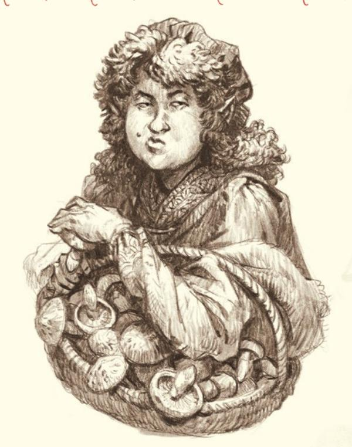

Those who discover Gerda's secret will undoubtedly draw her ire at first, though once she realizes her secret is safe with the Player-heroes, what began as a most awkward relationship could develop into a genuine friendship. It's quite possible the characters may be invited to Gerda's personal table to sample the freshest and best mushrooms available!

# **little delving**

Due south of Nobottle, with a short trail across the White Downs connecting the two, is the village of Little Delving. Named as if it was a younger sibling to Michel Delving, its people like to think that the two settlements are very alike. In truth, the Hobbits of Little Delving remain humble in comparison to their counterparts in Michel Delving; small houses with neat gardens are packed tightly together on rolling hillsides. Little Delving is particularly well-regarded for its livestock — flocks of sheep graze freely on the untended grassland to the west of the village.

The main building of Little Delving is an old rounded tower house, once serving as a watchtower and beacon for the western border of the Shire. Now it is used mainly as an enclosure where the livestock is herded in times of particularly bad weather.

# **michel delving**

If Hobbits followed the ways of Men and named a town as their capital, that would be Michel Delving. The chief township of the Shire is nestled in the rolling countryside that is the heart of the White Downs. Many wealthy gentlehobbits are proud to call this their home, and mayor Pott Whitfoot keeps a fine home in the largest Hobbit-hole in the Westfarthing outside of Bag End: the Town Hole. From here, the Mayor of the Shire ensures that the Shirriffs maintain what

few duties they have in these days of peace (mainly, presiding at banquets), and oversees the Messenger Service and the Quick Post in his position as Postmaster.

The true jewel of Michel Delving, however, is the local museum. Called the *Mathom-house*, it sits upon the hill just south of the Town Hole. There, cantankerous custodian Malva Slowfoot and her husband Bingo tend to a veritable hoard of Hobbit-treasures, or 'mathoms', as Hobbits call them. These range from a pair of sparkling diamond studs once owned by Gerontius Took, to a coat of silver rings supposedly worn by Bilbo Baggins that was gifted to him by a Dwarven king. Other oddities include a collection of wheeled contraptions known as 'velocipedes' constructed by Tom Sandyman some time ago, and the first tobacco pipe used by Tobold Hornblower himself (as can be readily seen by these examples, Hobbits call 'mathoms' all those objects they come to own that they have no immediate use for, but are unwilling to just throw away).

The Mathom-House is particularly renowned for its extensive collection of cookbooks, genealogical records, compilations of Hobbit-lore, old weaponry, and maps. Some of these maps date as far back as the days of Marcho and Blanco themselves, or so the legend claims. Particularly troublesome young Hobbits sometimes take it upon themselves to see if they can snatch some mathom of minor importance from under the nose of the Slowfoots, who take pride in their meticulous care of each and every item in the museum's catalogue. In recent years, the couple have even gone so far as to put locks on the door of the Mathom-House, to deter what they call "the worst folk to invade the Shire since the days of Golfimbul the Goblin." All this confustication has only driven naughty Hobbit-boys and Hobbit-girls to find new and more devious methods to drive Malva and her husband to distraction for their own entertainment.

### **THE FREE FAIR**

Every year, during the high summer days of Lithe (around Midsummer), a Free Fair is held on the White Downs, a few miles west of Michel Delving. For three days (four in a leap year) Hobbits from across the Shire join in merriment to celebrate the bounty of the land, feast among friends, and set up stalls in hopes of selling their own wares. Great stores of food and ale are drawn up from the storage tunnels where they have been gathered in the preceding weeks, and one can be assured that all corners will, in fact, be quite filled up during the Free Fair.

Once every seven years the Free Fair also hosts the election of a new Mayor (or the confirmation of the previous one); the last election occurred in the year 1357 S.R., when old Cotman Bunce resigned his office, and Pott Whitfoot was elected in his place.

18

Andreas Danielsson (Order #34277159)

Until a few decades ago, Gandalf the Grey himself appeared regularly at the Free Fair. He used to hold a special show based on his magical fireworks, during the Old Took's Midsummer-eve parties — a display no Hobbit could ever forget. Unfortunately, the Wizard hasn't shown up for the occasion in the last forty years or so, since his good friend the Old Took died.

# **CONCERNING THE GREY PILGRIM**

If the Player-heroes ask around about the latest news or rumours concerning Gandalf, the Loremaster can roll a Feat die to see what is being said regarding the latest disturbances brought about by the Grey Pilgrim.

#### GANDALF GOSSIP TABLE

| FEAT DIE ROLL | RESULT |
|------------------|--------|
|------------------|--------|

- Inquiring into the affairs of the Wizard has drawn his personal attention, and Gandalf himself shows up. Now, what errand or adventure could he have in store for the Player-heroes?
- 1 "Bilbo is digging new tunnels into the Hill on orders from Gandalf! If he goes any deeper, the whole of the Hill and everything upon it is going to collapse in upon itself and we'll be buried in dirt and gold!"
- 2 "Gandalf is in league with Gerda Boffin, I say! That's how she makes her crock, I tell you. I won't be eating no soup with Wizard-enchanted mushrooms. Who knows what kind of deal she's made with that conjurer!"
- 3 "I heard that Paladin Took has made some kind of deal with the Wizard, trading blessed farmlands for some strange promise. It's not right I say."
- 4 "I don't rightly know what he's up to, but last I heard Gandalf was wandering the North Moors, chasing giants and casting curses. I saw lightning strike the hills to the north at night!"
- 5 "Found another Dragon, I tell you! That's what I heard! He's looking for some new Hobbit to drag off into the wilderness now that Baggins has gone all cracked!"
- 6 "It's no business of mine, but I saw Gandalf arguing with Lalia Clayhanger down in Tuckborough on some matter related to the Old Took. Even if I was a Wizard, I wouldn't tangle with that one."
- 7 "Saw him coming up south from Sarn Ford near Longbottom and he wasn't alone. Talking to some fierce-looking and dirty traveller he was. Nothing good will come of it, mind you. Nothing good at all."
- 8 "Trundling down the Stock Road on his cart he was, on some errand all his own. Paused and as easy as I talked to my gaffer at Sunday dinner he struck up a conversation with a bird. He's cracked, I tell you."
- 9 "I heard from Mr. Mudwort down in Deephallow that he was knee-deep in the mud of the Overbourn Marshes, trying to conjure the dead! Keep that one and anyone who dares call him a friend away from me!"
- 10 "Stayed the night in Brandy Hall, he did. Sat at the Master of Buckland's table like he was some longlost kin! Imagine that?! Then, pleased as you can be, he opened the Hay Gate and disappeared into the Old Forest like it was just a Sunday stroll.
- A small group of Bounders or some ill-tempered gossip accuse the Player-heroes of being in league with the Wizard in some conspiracy that will come to a bad end. The Player-heroes will need to make a **PERSUADE** or **RIDDLE** roll to convince their accusers of their innocence.

#### **MAYOR POTT WHITFOOT**

Elected Mayor just over three years ago, Pott Whitfoot fancies himself a consummate Hobbit about town, and attributes to his role as mayor an importance that is scarcely recognised by anyone else in the Shire. His obligation to preside at all public events, ensure the Bounders and Shirriffs are doing their due diligence, and to see that the speed and quality of the Messenger Service and Quick Post are beyond reproach, is of supreme importance to him. After all, if he's not doing his proper mayoral duties, he won't have a place of honour at the many tables he's invited to across Michel Delving, and he is the first to point out that dinner with the Mayor is a high honour indeed.

For all his self-importance, Mayor Whitfoot is a sensible enough fellow and hopes to avoid any trouble or gossip-worthy activities during his tenure. He is quick to pass along any requests to address strange goings-on to his Bounders, and send them after any foolish young

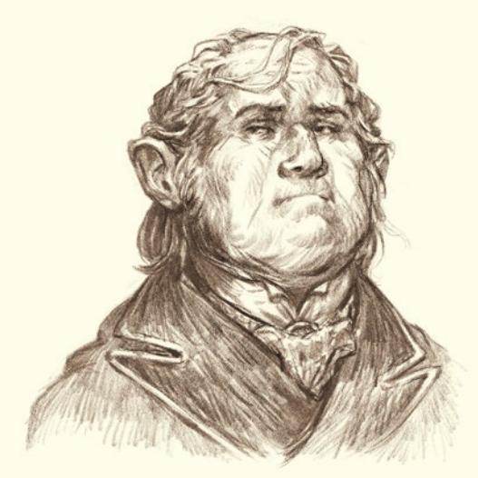

Hobbit reckless enough to traipse into the North Moors or beneath the eaves of the Woody End. Best to wash his hands of such concerns, and leave them to younger, less dignified Hobbits.

# **THE MESSENGER SERVICE AND THE QUICK POST**

Hobbits like to keep in touch with their friends and more likeable relatives, and those who know their letters enjoy writing almost every day. This regular correspondence is delivered anywhere within the boundaries of the Shire by the Messenger Service and the Quick Post. The first employs numerous Messengers, tasked with delivering letters and small packages between the homes and businesses of the Four Farthings. The Quick Post is employed only on official business, to deliver messages from the Mayor, or between the Shirriffs, for example, and is manned by a smaller number of quick runners.

Every larger township, like Hobbiton or Bywater, has its own post-office, and a number of postmen making the rounds, but the main Post-office is in Michel Delving. Postmen and Messengers can be seen carrying out their duty from there to Greenholm, Stock and everywhere in between. No postmen reach Buckland though, as most letter carriers are wary of the communities along the eastern banks of the Brandywine.

Existing for as long as any Hobbit can recall, serving as a postman is a position of respect among the communities of the Shire. Perhaps this is why a blind eye gets turned when a jar of preserves arrives at its destination a little less than full or no one bothers to mention that their sack of apples arrived a bit light. After all, walking one's appointed route can be hungry work.

# **needlehole**

A village in the northern reaches of the Westfarthing, Needlehole is cut in two by the Water as it comes down into the Rushock Bog. A small stone bridge crosses the stream here, allowing the road to continue eastwards towards the village of Oatbarton. The Hobbit families of Needlehole live in sturdy homes of wood and stone within sight of the Water, and have something Dwarvish about them — by most accounts, they wear boots when they go wood-gathering and duck-hunting in the Rushock Bog to the south!

If Needlehole is known for anything, it is for the pipes that their inhabitants craft using bog-wood, tree-trunks that have lain buried in the southern wetland for centuries, if not millennia. Hard as stone, the trunks of bog-wood must be carved with special tools that the inhabitants of Needlehole obtain by trading with Dwarves. Bog-wood pipes are dark in colour, their hues ranging from a deep brown to black, with the deeper shades coming from the most ancient and most prized qualities of bog-wood.

# **nobottle**

Tucked away in a remote corner of the Westfarthing, where the chalky heights of the White Downs become low knolls covered in thick grass, is the tiny community of Nobottle, a village home to no more than four or five families of Hobbits. Unlike most other villages of the Shire, the residents of Nobottle make their homes primarily in Hobbit-holes, with only one or two houses constructed along its outer edges. They keep mostly to themselves, quietly tending their land and growing their crops of bilberries and wheat. They will, when the occasion strikes them, venture upon a day trip to Little Delving or Needlehole, but will rarely go any further. By all accounts they mind their own business, and expect others to do the same.

But if the inhabitants of Nobottle can be considered to be somewhat unwelcoming, they are considered to be jolly fellows when compared to the Banks, their neighbours, a handful of closely-related families of fishermen dwelling on the shores of the Water a few miles to the northeast of the village. Already regarded with suspicion for their connection with the North-Tooks of Long Cleeve, their reputation is made even more sinister by their preference to move about on boats along the Water.

# **rushock bog**

As the Water rolls off the North Moors into the Shire, it slows down upon reaching Needlehole, until the river vale becomes almost flat, and the stream starts to meander in a hundred rivulets. The surrounding landscape is that of a vast marshland stretching for several miles, and a walk across it is likely to leave mud between one's toes. No Hobbit has reason to venture there for leisure though, as the area is thick with stingflies and gnats — in the warmer months of the year they can be seen rising as a cloud at sunset.

Despite these terrible threats, daring duck hunters and gatherers of bog-wood from Needlehole enter the marsh several times a year. They can be seen traipsing around wearing boots, the duck hunters armed with bows and carrying the carefully-painted wooden ducks they use as decoys, the wood gatherers leading sturdy ponies that they will use to pry their prized tree-trunks out of the bog's cold embrace.

Following the course of the Water through the bog is a back route to reach Hobbiton, and some hunters from Needlehole walk all the way there to sell their catch to the local inns and families.

### **CHILDREN'S STORIES**

Although it is true that adults like to spin tales and gossip about it over a pint, no true strangeness or oddity has ever been observed in the Rushock Bog by any grown Hobbit. In fact, only the younger lads and lasses can say that they have ever seen the little black creatures with large, luminous eyes that crawl through the mud at night…

Once in a while, tales told by Hobbit children about these shy and disturbing entities surface in Overhill, Hobbiton, or Needlehole. Described as more unusual than threatening, they have always been promptly dismissed as imaginary bugbears by parents and relatives, leading the children to keep their sightings largely to themselves, a secret whispered from ear to ear. The most adventurous among them have developed all manner of unlikely theories, and have started keeping watch for long hours at the edge of the bog, setting rudimentary traps at seemingly random locations, in the hope of capturing one of what they have collectively come to call the "Bog Beasts."

To this day, in spite of many claims that some little Hobbitboy or Hobbit-girl "very nearly got one," a Bog Beast has never been captured. Strangely, as Hobbits grow from child to tween, their interest in the Bog Beasts fades, and by the time one has reached the age of maturity, they seem to preserve no memory of the creatures at all.

# **the tookland**

The western range of the Green Hills rising in the Westfarthing has always been known as the Tookland since time out of mind. It is aptly named, for it is the ancestral home of what is considered by many to be the chief family of the Shire, the numerous and well-respected Took clan. Here, small farms dot the rolling hills where one Took cousin or another grows grain and barley for bread and beer, keeps hives of buzzing bees for honey and mead, or makes their living hunting small game for fur and meat.

The Tooks are renowned for being a bit too adventurous for traditional Hobbit tastes, and while that may be so, there's a charming irrepressibility about the entire clan that often reveals itself in the wit and wisdom that pervades the gaffers and gammers of that family. This reputation for mischief is of little concern to the Tooks, and in fact, is a point of pride to more than a few of that line.

Unlike in many other regions of the Shire, the Wizard Gandalf always receives a warm welcome whenever he passes through the Tookland, as no one among the members of the clan forgets that the Grey Pilgrim was a good friend of the most famous Took of them all, the Old Took himself.

In spite of their propensity for the outlandish and the friendship of Wizards, the Took Clan is greatly respected by everyone in the Shire. This is likely due to the legacy they carry as the holders of the Thainship since Isumbras the First accepted both the title and role from Gorhendad over five hundred years ago.

A winding trail running east off Whitwell on the North Road reaches the village of Tookbank, upon the westernmost rises of the Green Hills. The scent of apples ready to be plucked from the appledores, the sound of delighted children playing "Greenfield Goblin," or the sight of mushroom tents are encountered before the round doors of any Hobbit-holes become apparent.

Tookbank is a small village, much smaller than the nearby Tuckborough, to the chagrin of its inhabitants who feel they are looked down on by their neighbours. A wish to avoid any contact might explain why no road leads from Tookbank to the nearby town, and why no one in the two communities has ever demonstrated the desire to build one.

Rumours outside the Tookland speak of an extensive network of tunnels dug under the Green Hills and joining Tookbank with the Great Smials, and comprising vast underground halls where the Tooks join in secret merriment several times a year.

# **tuckborough**

Tuckborough is the largest village in the Tookland, and the one counting more Hobbit-holes than any in the entire Shire. It is here that Great Smials stands, the many-tunnelled mansion of the Took clan, dug three centuries ago at the time of Isengrim the Second. Known also as the 'Great Place of the Tooks', it's a veritable maze of bedrooms, parlours, kitchens and dining halls, serving as the home of a multitude of family members. Deep inside it lies a place known simply as 'the old room', the large hall where Gerontius, the Old Took, spent most of his life. It is said that the room didn't see changes to its decor and furniture for decades, for the Old Took liked it exactly as it was, and that to this day no Hobbit — Took or

otherwise — has dared to move so much as a leaf of parchment, let alone Old Took's rocking chair! In fact, his reading glasses sit on an end table by the chair next to his pipe, where he sat them down on the night before he passed forty years ago.

Since the time when Gorehendad Oldbuck gave up the title of Thain and moved across the Brandywine and Isumbras the First assumed it, Great Smials has also been the seat of the Thainship. Though the title is little more than an honorific these days, respect for the position is still maintained — especially among the Hobbits of the Westfarthing. Fortinbras the Second has been Thain nigh on thirty years now, and by all accounts he is as good and wise a gentlehobbit as any could ask for.

# **waymeet**

A merry stroll east out of Michel Delving along the East Road will lead a wandering Hobbit to the crossroads at Waymeet. Appropriately named, it is not only a crossroads, but also where Hobbits from across the Westfarthing come together to trade goods and gossip in equal measure. In fact, many of the homes have adjacent or attached sheds to act as both storage and storefront for trinkets and wares readily available to any passersby travelling along the East Road.

A collection of tables sits right along the road in the middle of Waymeet, before the doors of the Walking Party Tavern. It serves as an open-air tap house of sorts, where visitors can quench their thirst before going about their business, and maybe purchase whatever mathom catches their eye in the tiny shops that line the thoroughfare. More than one Dwarf crossing the Shire has stopped at the tables of Waymeet for a pint and a game of ninepenny marl, while being forcefully brought up to date on the latest gossip offered by the idle gammers and shopkeepers.

### **A DAY IN WAYMEET**

A trip to Waymeet is never boring, and if the Playerheroes opt to spend an afternoon, the Loremaster can

roll a Feat Die on the table below to determine a random event or design one themselves.

#### WAYMEET JOURNEY TABLE

| FEAT DIE ROLL    | RESULT                              | DESCRIPTION                                                                                                                                                                                                                                        |
|---------------------|-------------------------------------|----------------------------------------------------------------------------------------------------------------------------------------------------------------------------------------------------------------------------------------------------|
| Image: [rune]       | Chance Encounter                    | The Player-heroes encounter a well-known local or famous visitor as they pass through Waymeet. Examples include Bilbo Baggins, Gandalf the Grey, Balin the Dwarf, or even catching a glimpse of an Elf moving west just at the edge of town. |
| 1                   | Mistaken Identity                   | A local Hobbit mistakes a Player-hero for a distant, long absent relation, and insists on recalling old family stories the character has no knowledge of.                                                                                       |
| 2                   | A New Friend                        | The Player-heroes strike up a pleasant conversation with a fellow visitor at Way- meet who invites them to tea the next time they're about.                                                                                                     |
| 3–4                 | A Foolish Trade                     | The character finds they've made a bad deal at the market and is down a few coins or has swapped a valuable item for some useless junk.                                                                                                         |
| 5–7                 | A Peach of a Deal                   | The character was able to strike a good bargain and walked away with a new tool or item that may be of some use in the future, as determined by the Loremaster.                                                                                 |
| 8                   | Rumours                             | The Player-heroes spend a long evening swapping news with the locals and learn a piece of information or clue that offers insight into one of their upcoming adventures.                                                                     |
| 9                   | Idle Words                          | The Player-heroes hear news about some other person or place in the Shire that turns out to be false but seems credible at the time.                                                                                                            |
| 10                  | Tales from Beyond the Brandywine | The Player-heroes learn some news from beyond the borders of the Shire while having a drink at the Walking Party Tavern.                                                                                                                        |
| Image: [eye symbol] | Robbed!                             | A Player-hero must make an AWARENESS roll, or they realise someone has picked their pocket during the hustle and bustle of the day. An item very important to them has been stolen!                                                          |

# **whitwell**

A sure sign that one is about to enter the village of Whitwell is the sound of the crowing roosters and clucking hens that wander its coops and farms. This small community is known for its chicken farmers, and many members of their flocks find their end at tables across the Shire. In spite of its humble appearance, Whitwell serves as a hub of travel in the Tookland, with pipe-weed coming up from the farms of Longbottom, travellers going south from Waymeet, and Tooks arriving endlessly from Tuckborough. These visitors will find the finest roast chicken in the Four Farthings if they sit down at a table

at the Fairest Fowl Inn, which sits right upon the crossroads at the heart of Whitwell.

The latest news heard over these fine meals is that of a young enterprising Hobbit by the name of Paladin Took who has recently come to Whitwell from Tuckborough. A first cousin once removed of Thain Fortinbras (on his father's side), Paladin stands out as an oddity among the many chicken farmers, for he has begun tilling land and planting seeds in hopes of turning his new farm into a grand enterprise worthy of attracting a fine wife.

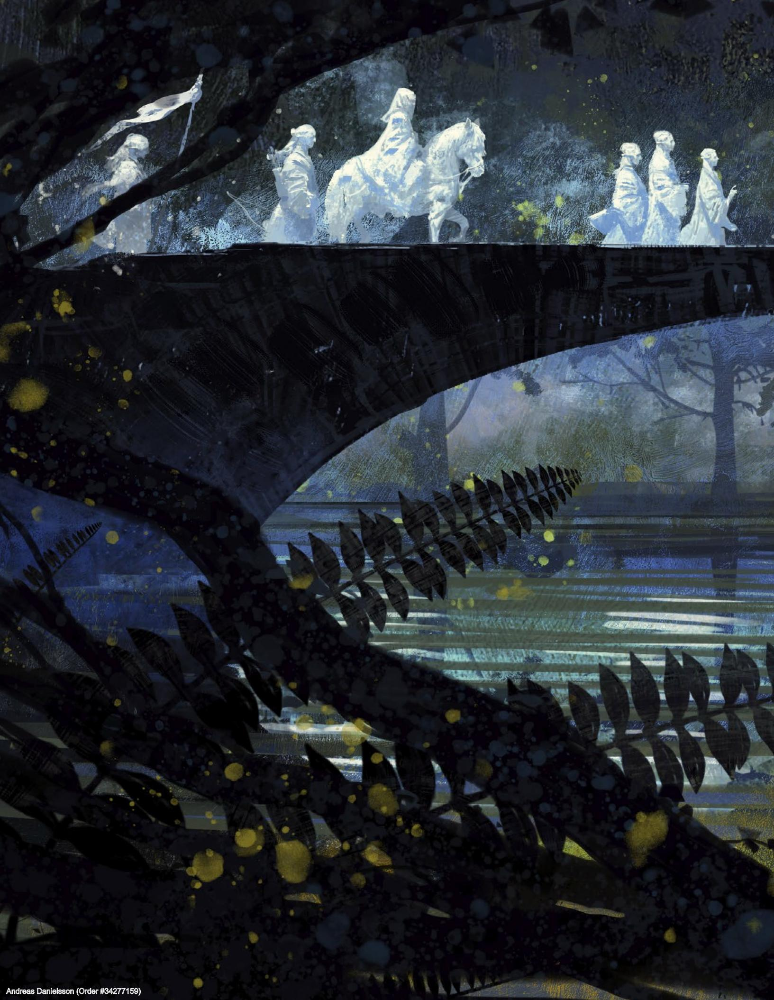

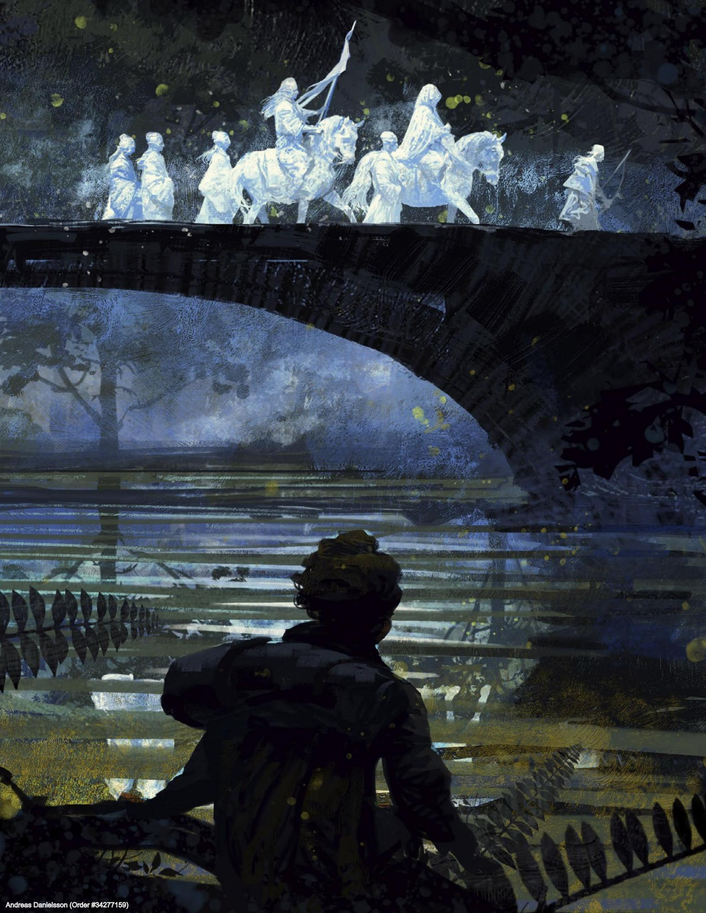

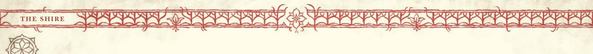

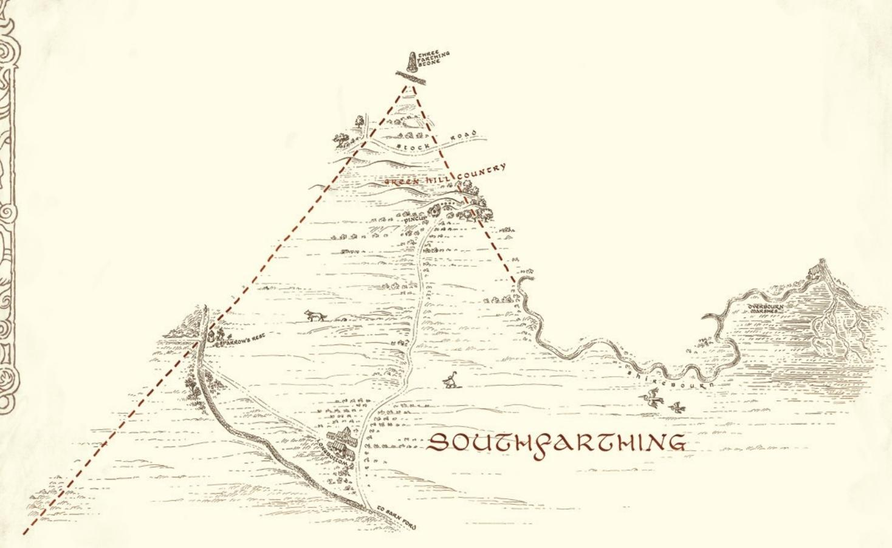

# the southfarthing

*How Old Toby came by the plant is not recorded, for to his dying day he would not tell. He knew much about herbs, but he was no traveller.*

As the land of the Tooks rolls east and gives way to the Green Hill Country, the wide fields of the Southfarthing spread southwards from the Three-Farthing Stone. It is a sparselypopulated land by Hobbit standards, traversed in the north by the Stock Road that runs through the Yale in the Eastfarthing, and bordered by the Shirebourn river to the southeast. Largely made up of isolated farms and wide fields, it is here that the best wine found in the Shire is produced, and where the most prestigious varieties of pipe-weed are grown.

# **longbottom**

Longbottom is the pride of the Southfarthing. Perhaps less a town and more a collection of many farms with stout homes of wood and stone, Longbottom outgrew its boundaries at the time of Tobold Hornblower, the first Hobbit to grow the true pipe-weed in the Shire. Each farm is surrounded by vast, furrowed fields, from which the leaf is harvested and processed.

It is from around here that the three most popular brands of pipe-weed come from: 'Longbottom Leaf', 'Old Toby', and 'Southern Star'. Carts loaded with barrels carrying the Hornblower brandmarks can be seen travelling up and down the road at any hour of the day, headed to the farthest corners of the Shire. There are even rumours of enterprising Hobbits making the journey all the way to the Blue Mountains, west beyond the Shire, or eastwards over the Brandywine all the way to Bree — though perhaps those travelling in that direction are doing so more to reinforce the superiority of the Shire leaf over the Southlinch crop grown in those parts.

Wherever their destination may be, travellers leaving Longbottom and taking the road north are likely to stop at the inn at Sparrow's Rest, located about a day's travel towards

Andreas Danielsson (Order #34277159)

the border with the Westfarthing. A welcome sight to the weary eyes of every travelling pipe-weed merchant, the inn used to be a small watchtower, and takes its name from the many birds nesting under its eaves. By all accounts, no inn offers a better serving of strawberries and cream anywhere in the Shire, and a more diversified source for gossip — pipeweed merchants hail from all over the four Farthings, and find the inn to be the perfect place for the exchange of news.

# **pincup**

Nestled on the southern slopes of the Green Hill Country, Pincup is home to a handful of Hobbit families that live quiet lives in relative isolation. Most live in modest Hobbit-holes among the shaded hillsides, others keep small farms just beyond the shadows of those mounds for growing autumn crops like radishes, turnips, and carrots.

But it is going west that one reaches Pincup's true and only claim to fame: its vineyards. Raised on the steep hillsides facing south, it is here that the grapes used to produce the best wine in the Shire are cultivated — known simply as Old Winyards, it is a strong red wine that grows in value as it ages, so much that older bottles are treasured. Bottles of vintages from as far back as a century have been given by Tooks to their relations and close friends on birthdays and special occasions since time out of mind.

# **sarn ford**

Far beyond what any reasonable Hobbit would call a proper part of the Shire, is the stone river crossing of Sarn Ford, at the southernmost border of the Southfarthing. During the drier seasons, the Brandywine becomes so shallow here that it can be waded without any danger. In Spring and Autumn the thaw and heavy rains make it less safe, if it wasn't for a number of large, flat rocks, set across the ford in times of old, allowing travellers to use them as stepping-stones.

Sarn Ford is a deserted place, and for some reason, no Hobbit in their right mind would think of spending more time there than what's strictly necessary to cross the river more than one traveller on the South Road claims to have seen strange, hooded men wandering about in its vicinity.

#### **THE WATCH OVER SARN FORD**

A long time ago, in an age of the world beyond the reckoning of Men and Hobbits, Sarn Ford was the site of a terrible battle. An invading army out of the Black Land was broken with great

slaughter, leaving an indelible mark across the region that can still be perceived after long millennia — Hobbits rarely linger here for any length of time, as the air itself seems to disagree with their cheerful disposition.

Whether they themselves know about the past history of the place or not one could not say, but the Rangers of the North keep a constant watch over the crossing. The ford is the first safe passage over the Brandywine river — the next one being the Bucklebury Ferry, more than fifty miles upriver to the north, and travellers coming from the south along the road must use it to enter the Shire. The Rangers take great care not to reveal their presence, disappearing quickly into the wilderness if they are in risk of being spotted. A few secret caches of supplies, such as firewood and dried meat, and at least one store of weapons, have been set up close to the ford, marked with runes and easily overlooked as another minor oddity from outside the Shire by all but the most educated of Hobbits.

#### **HALLAS AND HALBARAD**

The captain of the Rangers tasked with watching over Sarn Ford and the southern borders of the Shire is a Man called Hallas. Wise in old lore and a veteran fighter, Hallas has grown fond of the pipe-weed of the halflings. In the company of his son, Halbarad, they sometimes enter the Southfarthing disguised as merchants from Tharbad, and visit the Inn at Sparrow's Rest to keep up with the latest rumours (and to fill their pipes with the best Hornblower leaf).

# **the shirebourn river**

A good part of the eastern border of the Southfarthing is marked by the Shirebourn, the watercourse flowing from the Green Hill Country across many miles of lowlands. Once it meets another stream, the Thistle Brook, flowing out of the Eastfarthing at Willowbottom, the Shirebourn slowly winds its way for about fifteen miles, until it reaches the Brandywine near Deephallow. The Overbourn Marshes spread at the river mouth, among reeds and willow thickets.

Residents of the Southfarthing rarely venture so far east though, except for a number of angling enthusiasts who dare go boating on the Shirebourn in small rowboats. Certainly no one enters the marshes — not even the nearby residents of Deephallow in their Dwarf-boots would dare go about trudging in this bog. Nothing dangerous has emerged from the marshes in living memory, but mournful noises and barely heard songs seem to drift above its still waters, carried by the breeze from the Old Forest.

Andreas Danielsson (Order #34277159)

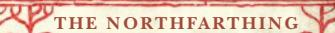

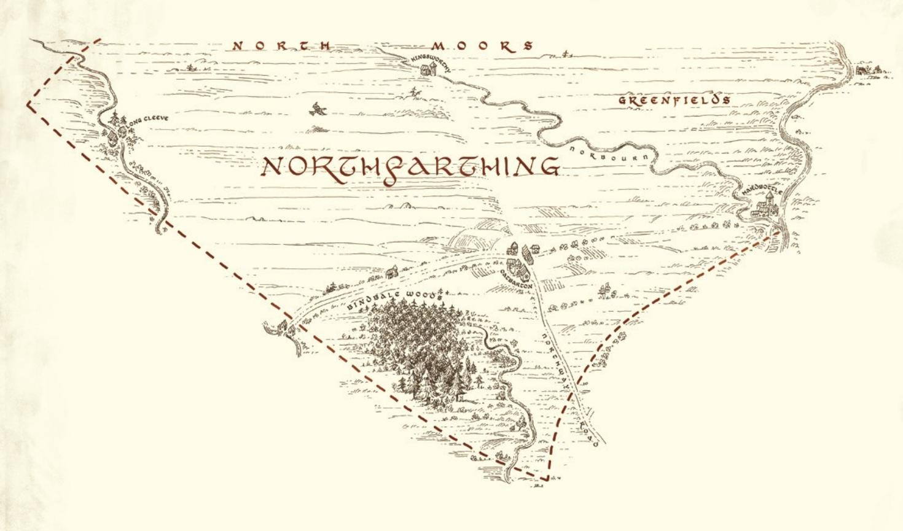

# the northfarthing

*Except on the high moors of the Northfarthing a heavy fall was rare in the Shire, and was regarded as a pleasant event and a chance for fun.*

The Northfarthing is the only quarter of the Shire whose borders are not marked by the Three-Farthing Stone. Most folk come to this area by way of the Northway Road, between Bywater and Frogmorton, heading on up over the Water and across the northern half of the Eastfarthing. The surest sign that you have crossed into the Northfarthing is the fresh, fragrant air that sweeps across the Greenfields and slips between the trees of the Bindbole Wood. Winters in this region tend to be a bit cooler and longer than in the rest of the Shire. Still, in those seasons of lesser sun, a blanket of winter snow is no small beauty to awaken to each morning as one sets the kettle to boil.

# **the bindbole wood**

Filled mostly with pines, junipers, and yew, the Bindbole remains evergreen year-round, with several of the trees producing lovely red flowers in early spring. Older than the Shire itself by most accounts, and exceedingly dark and tangled at its heart, this wild wood is all that is left of a larger forest that once ran all the way to the Hills of Evendim, beyond the North Moors.

Few Hobbit walking trails run under its spreading branches, as more than a few tales speak of wolves lingering in the shadows (though no wolves have been seen in the Shire since the Fell Winter). More likely, they're as real as the Green Dragon rumours about wayward Big Folk from the days of the King, or those talking of giants taller than trees walking seven yards to a stride in the North Moors. Even if these fanciful yarns are just that, the truth is that there are no easy trails through the Bindbole.

# **greenfields**

No exploration of the Northfarthing would be complete without mention of Greenfields. Known throughout the Shire as the place where Bandobras 'Bullroarer' Took drove back Golfimbul and the Goblin horde from Mount Gram, it is bordered on the south by the Norbourn, a watercourse descending

from the North Moors that joins the Brandywine just beyond the borders of the Eastfarthing, and running into the Northfarthing. It's a vast land, mostly flat in between the two rivers, rapidly rising as one turns north towards the Hills of Evendim.

Here, visitors are likely to see small groups of Hobbit rabbit hunters carrying bows. They spend long hours looking intently at the ground for coney tracks, or kicking and stomping at their hiding places. If one should start a conversation with any of them, they would hear the same story about how the game of golf was invented by the Bullroarer on that precise spot.

# **hardbottle**

To most Hobbits, to call Hardbottle a remote village would be an understatement — the only residents of the Shire travelling so far are hunters, Bounders, and the members of the Bracegirdle family and their numerous relatives. The village itself stands at the confluence of the Norbourn and the Brandywine rivers, and can be reached only by crossing the Norbourn on a boat.

This relative isolation hasn't prevented the Bracegirdle family from rising to a certain level of prominence in the Northfarthing. Known for their size (many family members are said to be of great girth), outspoken nature, and superior skill as masons, the Bracegirdle name is associated with the building of every new home or Hobbit-hole constructed this side of the Water. In particular, Blanco Bracegirdle and his son Bruno seem to have placed a brick or two in every home in the Shire, with Blanco having brokered deals with most mining businesses represented in Dwaling in the last three decades.

In recent years, Blanco Bracegirdle's wife, Primrose, born a Boffin, raised a flurry of gossip with her decision to leave Hardbottle and return to her family estate in the Yale — everyone in the

Northfarthing knows the 'real reason' behind her decision — from a bout of 'wandering-madness', the discovery of the secret cache of gold of her late father Otto, to the sudden appearance of a disfiguring disease.

# **long cleeve**

One can reach this little village on the edge of the Northfarthing by following the course of the Water towards the North Moors, well beyond Nobottle and Needlehole. Composed of a handful of houses along both sides of the river, it is the home of the North-Tooks, a smaller branch of the renowned clan who claim direct descent from Bandobras the Bullroarer himself, though there is a bit of a rivalry as to whether or not they can rightfully say so. Every Took knows that Bandobras left his home in the Tookland to settle in the Northfarthing only after the Battle of Greenfields, and that is why they dispute the North-Tooks appropriation of the Hobbit hero. Fortunately, the dispute is kept friendly by holding shared family reunions, which include "tests of heritage" nothing more than drinking contests, games of conkers, and the obligatory golf tournament.

# **the north moors**

This wide upland rises to meet the Hills of Evendim to the North, and marks the northern borders of the Shire. It is an area known for its heavy winter snowfalls and untamed wilder-

> ness, filled with scrub brush, heather, and the occasional tree. All sorts of cautionary tales and rumours spring out of the North Moors, and only the most hardened, or most foolish, hunters dare venture this far north, and they do it exclusively before the sun sets, for fear of encountering wild beasts or things far worse.

Where the Norbourn river flows out of the North Moors stands what the Hobbits of the Northfarthing call 'Kingsworthy', a large stone house with a round tower, believed to have been a hunting lodge at the time of the Kings in Norbury. The origins of the site are probably more prosaic, but the legend seems to have found confirmation when a few years ago a hunter dug up the life-size head of a marble statue, representing what resembles a young prince wearing a crown.

# **oatbarton**

The Northway ends in the village of Oatbarton, a settlement of modest size, surrounded by extensive oat fields. Its stone houses seem to emerge from a veritable sea of long stalks, bright green in Spring, golden by late summer. In winter,

#### **VENTURE INTO THE NORTH MOORS**

Stories of what lies concealed and undiscovered along these northern boundaries of the Shire range from hidden camps of shadowy big folk who lurk and watch Hobbit-kind from a distance, to fanciful tales of the trees themselves walking about in the light of day. To find out what happens during a trip to the North Moors, the Loremaster can roll a Feat Die and consult the following table.

#### NORTH MOORS ENCOUNTERS TABLE

| FEAT DIE ROLL | RESULT                          | DESCRIPTION                                                                                                                                                                                                                                                                                                                        |
|------------------|---------------------------------|------------------------------------------------------------------------------------------------------------------------------------------------------------------------------------------------------------------------------------------------------------------------------------------------------------------------------------|
|                  | A Wanderer's Campsite        | The Player-heroes come upon a Man in travel-worn clothing cooking a pair of rab bits on a spit. There is a welcoming quality about him, in spite of his rugged look. He offers the Player-heroes a spot by the fire. If they accept, they hear him tell stories about the lost realm of Arnor, the land of the High King… |
| 1                | Moaning Trees                | An eerie and unnerving moan rings through a tiny grove of pine trees, as a cold wind blows down from the hills to the north.                                                                                                                                                                                                    |
| 2                | A Fissure in the Ground      | The Player-heroes stumble upon a great hole dug directly into the ground, large enough for several Hobbits to enter. Inside, they find a skeleton of prodigious size, a bear or a large Orc, and a crude club thrice their height.                                                                                           |
| 3                | A Crash and a Laugh          | A large stony crash is heard echoing down from the north, followed by a distant, booming laughter.                                                                                                                                                                                                                              |
| 4–7              | Ancient Relics                  | The Player-heroes discover an old object, like a pitted and rusted sword or knife blade, a brooch, a broken jar or pot, etc. It is mostly useless, but makes for a perfect Mathom.                                                                                                                                           |
| 8                | Followed from the Shadows | The Player-heroes get the uncomfortable sense they are being watched and fol lowed. A cloaked figure seems to linger for an instant behind a far-off tree, then dis appears into the wilderness.                                                                                                                             |
| 9                | Wolf Carcass                    | A large dead wolf is found, slain with arrows too large for Hobbit bows still stuck in its side.                                                                                                                                                                                                                                |
| 10               | Uprooted Tree                | Though the ground looks otherwise undisturbed, there are signs that a tree has been ripped from the ground, roots and all. Large depressions in the soil can be seen trail ing off to the north and west.                                                                                                                    |
|                  | Wrathful Spirit              | A ghastly spirit rises out of a darkened shadow to plague the Player-heroes, the hiss of "Angmar" on its spectral lips as it passes through them and leaves a chill far deeper in their bones than any winter ever could. They will have dark dreams about it for a few days.                                             |
|                  |                                 |                                                                                                                                                                                                                                                                                                                                    |

heavy snows regularly blanket Oatbarton, and Hobbit children delight in re-enacting the Battle of Greenfields using snowballs and snowgoblins, which they promptly trounce with the largest stick available.

The village itself would be quite unassuming, if it wasn't for its great cobblestone courtyard, situated right in its heart. Surrounded by granaries, wooden homes, barns, and sheds, the courtyard becomes crowded at noon, when all farmhands

from the nearby fields gather to eat lunch — the simple, hard-working folk of Oatbarton sit at long tables set up on trestles, under tents and pavilions during the harvest season.

The produce of the fields of Oatbarton is used by breweries all over the Shire to make a particularly bitter beer, called by some the 'Dwarven Stout'. A drink that needs growing accustomed to, it is favoured by travelling Dwarves, who don't seem to mind the sharper taste at all.

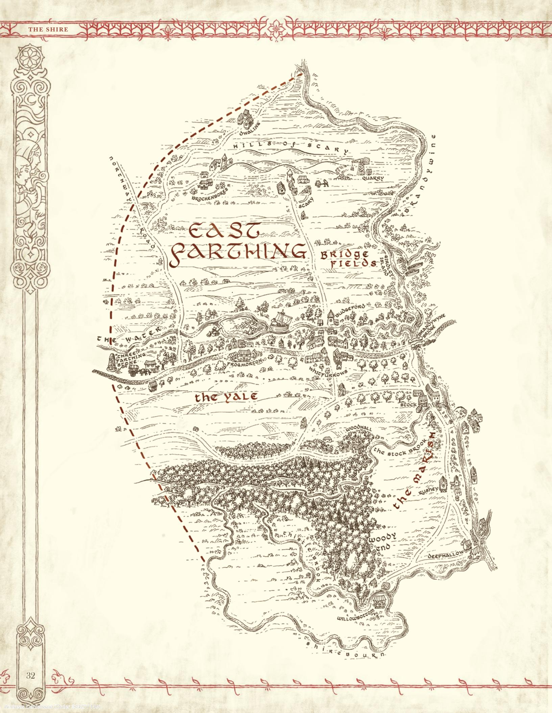

# the eastfarthing

*The Hobbits of that quarter, the Eastfarthing, were rather large and heavy-legged, and they wore dwarf-boots in muddy weather.*

While not quite the largest of the Four Farthings, the Eastfarthing is most certainly the oldest, as it is this land that the founders of the Shire encountered first, when they crossed the Bridge of Stonebows long ago. From the Three-Farthing Stone in the west to the Brandywine Bridge in the east, the quarter is divided in two by the East Road and the course of the Water. The northern half is an upland, dominated in its middle by stony hills, and slowly rising towards the North Moors. The southern region is wilder, crossed by innumerable streams and brooks, sometimes leading to vast patches of marshland. The main townships of the Eastfarthing are Frogmorton and Whitfurrows, along the East Road.

Many Hobbits living in this part of the Shire bear some distinct physical features, when compared with their neighbours. They are generally heavier in build, and some even sport a trace of beard on their chin (no Hobbit living elsewhere ever displayed anything so uncanny). Esteemed Hobbit 'historians' attribute these peculiarities to the fact that the ancestors of the Hobbits of the Southfarthing belonged to a southerly branch of Hobbit-kind, where most of the other first settlers came from the West.

# **the brandywine**

Running for uncounted leagues from its source in Lake Evendim to its faraway mouth at the sea, the Brandywine River serves as the eastern border of the Shire. With the founding of Buckland, the river also demarcates the division between a land inhabited by proper Hobbits, and the wrong side of the river, where the Bucklanders dwell. Whether east or west, the watercourse occupies a prominent place in the lives of a great many Hobbits. Many boats, both fishing and leisure, can be seen crossing it, or moored along its banks, especially on the eastern side.

The main crossing is the Brandywine Bridge, also called the Bridge of Stonebows, a marvel leaping across the river in three graceful arcs. No Hobbit can recall the days when it was built, but the Shire-folk keep it in good repair as they were instructed to do so at the time of the Northern Kingdom. The bridge is wide and strong, allowing carts, ponies, and wagons to easily cross.

The other crossing, though less used and less trusted, is the Bucklebury Ferry, found approximately ten miles downriver, in the northern part of the Marish. This large, flat boat can be reached via a narrow lane off the Causeway running parallel to the Brandywine, and makes its mooring on the opposite bank in the heart of Buckland, near the village for which it is named. Though tended by a ferryman by day, no one remains in service after nightfall, and it is seldom used at such times for fear of some poor Hobbit slipping over its edge and plunging into the waters of the Brandywine.

# **GIRDLEY ISLAND**

Ten miles north of the Bridge of Stonebows, the Brandywine River bifurcates around a narrow island, about two mile in length. Called Girdley Island, it is covered with wild shrubs and low trees, and is rumoured to be a haunted place. Those few who have moored their boats there and made their way through the vegetation claim to have heard scratching noises or stirrings beneath their feet. As a consequence, the island is abandoned to its waterfowl and wild vegetation, save for some brave Bucklander or foolish Eastfarthing youth who visits it on a dare to test their valour.

Unbeknownst to everyone in the Shire, the secret of Girdley Island lies not in cursed spirits, but in hidden guardians. In the middle of the island is a secret refuge, built in recent years by the Rangers of the North. It is a small fortification, mostly underground, concealed in a great copse of trees. From here, the Rangers use their small, flat-bottomed boats to move swiftly up and down the Brandywine, easily moving as far north as Lake Evendim or south to Sarn Ford.

## **DWARVES ON THE ROAD**

Much to the Hobbits' consternation, Dwarves make regular use of the East Road, travelling to and from their home in the Blue Mountains far to the west of the Shire. It is not uncommon for local travellers to encounter these

bearded wayfarers on their errands to foreign parts as they pass through the heart of the Shire.

When the Player-heroes are on the East Road, the Loremaster can roll a Feat Die to determine if an encounter occurs.

#### EAST ROAD ENCOUNTERS TABLE

| ROLL | RESULT                   | DESCRIPTION                                                                                                                                                                                                                                                                                                                                                                         |
|------|--------------------------|-------------------------------------------------------------------------------------------------------------------------------------------------------------------------------------------------------------------------------------------------------------------------------------------------------------------------------------------------------------------------------------|
|      | Merry Merchant        | A particularly jovial Dwarf is returning to the Blue Mountains after a long trip from the Lonely Mountain. Delighted and glad to soon be home, he gives each Player-hero a gift, claiming that he is following the tradition of the locals and celebrating his own birthday! The gifts are nothing less than fine, and indeed, magical, toys from the mar kets of Dale! |
| 1–3  | No Encounter             | No special encounters are had.                                                                                                                                                                                                                                                                                                                                                      |
| 4    | Boasting Brewers      | The Player-heroes meet two Dwarven brewers from the Blue Mountains, burdened with beer-barrels bought at the Golden Perch. They claim to have discovered the secret of the 'best beer in the Shire', but appear to have sampled their wares a bit too much.                                                                                                                |
| 5    | Renowned Relatives    | A lone Dwarf stops the Player-heroes and asks for directions to Bag End, claiming to be a distant relation of one of Thorin's Company.                                                                                                                                                                                                                                           |
| 6    | Sullen Smith             | A visibly angry Dwarven blacksmith is hauling ore from the mines at Scary, upset and irritated at what he calls a "cross deal", and shoots the Player-heroes a mean look as he passes.                                                                                                                                                                                        |
| 7    | Bent Blades              | Shouldering a mighty wood axe and leading a pack mule, a Dwarf claims he tried to chop some wood from the Old Forest on his way here, but that the trees made groan ing noises and dulled the edge of his axe.                                                                                                                                                                |
| 8    | A Song for a Song     | A Dwarf is strumming on a harp as he sings to himself. He offers to teach one of the Player-heroes a Dwarven song in return for a local one. If obliged, he kindly gives the character a silver tin whistle engraved with Dwarvish runes as a thank you.                                                                                                                      |
| 9    | A Nice Nap               | A Dwarf has fallen asleep on the road, fat and content. A cooked sausage is still held in his meaty fist. If disturbed, he awakens with a start and asks for directions to the nearest inn.                                                                                                                                                                                   |
| 10   | Beleaguered Beards    | The Player-heroes spot a group of Hobbit children running down the East Road, their leader holding a tuft of hair in their fist. Behind them comes a lumbering Dwarf, shouting and holding the end of his beard.                                                                                                                                                              |
|      | Appalling Accusations | A particularly cantankerous Dwarf halts one of the Player-heroes as they pass, accus ing them of theft and mistaking the befuddled travellers for someone else. The Player-heroes will need to do some fast talking if they hope to avoid an awkward confrontation.                                                                                                        |

# **bridgefields**

Bridgefields is the name of a long stretch of fertile land extending for about three leagues west of the Brandywine Bridge, and likely named in reference to it. The most prominent village of the district is certainly Whitfurrows, the first township of the Shire one encounters when travelling west along the East Road.

#### **WHITFURROWS AND BUDGEFORD**

Acting as an eastern counter to Waymeet in the Westfarthing, Whitfurrows lays at the crossroads of the East Road and the winding path that leads north to the Brockenbores and Scary. Hobbits from across the Eastfarthing come to Whitfurrows to do a bit of brisk trade, as do Dwarves going west towards the Blue Mountains — though they get a bit of a cold shoulder from most locals. In years past, even a few Bree-Hobbits showed up to trade with the Shire-Folk, but those days have long gone by. The district includes to the north the community of Budgeford, a village built upon both banks of the Water. Budgeford is the seat of the Bolger clan, an ancient family with a long tradition of high-sounding names.

# **deephallow**

The village of Deephallow is nestled near the corner where the Shirebourn meets the Brandywine, at the southernmost tip of the Southfarthing. It is reached by taking the road that branches out from the East Road near the Brandywine Bridge and by following it to its very end.

The Hobbits that make their homes here have a reputation as a cantankerous lot, perhaps due to their feud with the Buckland Hobbits of Haysend, on the other side of the Brandywine (theirs is a Hobbitish rivalry, expressed mainly in words and surly looks). They seem to have less love for merriment than other Hobbits, and most even bar their doors at night. This lesson is one they undoubtedly took up in a manner similar to their Buckland rivals, though if reminded of this they will vehemently deny even this most tenuous connection. Those rare visitors that travel so far south are given a cold reception, though this is not due to malice — the Hobbits of Deephallow seem to know better than their western counterparts what lies just beyond their borders, and are reluctant to have such dangers fall upon their neighbours.

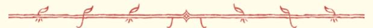

## **FORGOTTEN FOXGLOVE**

In a time when the rivalry between the folk of Deephallow and that of Haysend ran deeper, there lived a Hobbit girl whose name has been forgotten. She fell in love with a Hobbit of Haysend, and the enmity between their families kept them

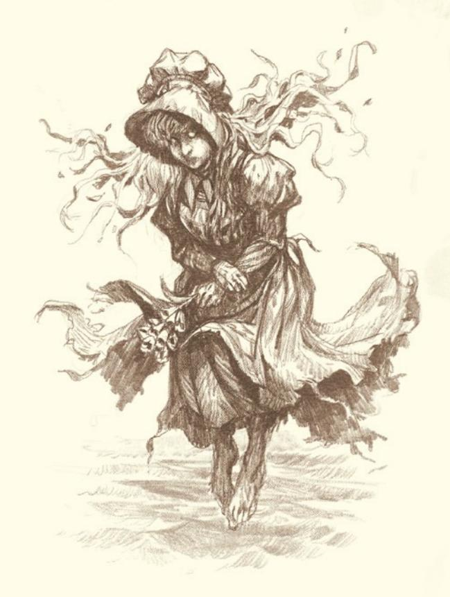

forever apart, until she was driven mad by sorrow and walked into the Overbourn Marshes and was never seen again. Some among the more superstitious folk of Deephallow claim that she still lingers there, singing a lament for her one true love in hopes of luring him — or any young Hobbit foolish enough to be enchanted by her voice — into her arms and to a watery grave. Known by the locals as the Forgotten Foxglove, she wanders the Overbourn Marshes, her gaze forever cast downward.

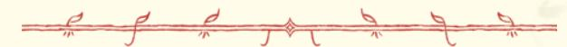

# **frogmorton**

Travelling out from the Three-Farthing Stone along the East Road, one will first come to the village of Frogmorton on the southern banks of the Water as it splits in two flowing westward, creating a large eyot. Named for the croaking chorus that fills the air on summer nights, this community marks the halfway point between Hobbiton and the Brandywine Bridge. Frogmorton is perhaps most well-known for the Floating Log, the first good inn one encounters on the East Road heading west (the establishments of Whitfurrows and Budgeford are not worth mentioning). A fine establishment certainly, if only its proprietor Juniper Broadbelt would give up her family's endless quest to somehow prepare frog legs as a proper meal.

# **the hills of scary**

Going north on the road from Budgeford, one travels towards a range of hills that rises almost along the border with the Northfarthing. Against the side of the hills one finds first the village of Scary, then the Brockebores to the west, and on the other side, the township of Dwaling. It is under the hills of Scary that the first settlers found lodes of iron ore, and it is from here that the Shire-Hobbits still extract the mineral and quarry the stone required to build their many houses above ground — the number of tunnels dug under the hills, from the Brockenbores to the quarries at Scary, are an indication of this centuries-old practice.

A bit too dour for the likes of their merrier cousins to the south, the Scary Hobbits and those of the Brockenbores rarely venture into the heart of the Eastfarthing. Most seem content to stick to their own business, undisturbed, a very Dwarvish attitude for a Hobbit to display. The Hobbits of Dwaling are friendlier and more open towards strangers than their neighbours, and they often act as intermediaries for the mining folk of the hills — they broker deals for them, and provide them with all they need to continue their work without distractions.

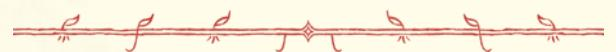

### **THE BROCKENBORES**

Hobbits are natural tunnellers, and have no fear of the underground. In recent years though, some miners from the Brockenbores have started to suffer from a coughing sickness and malady of the spirit that slowly drains their strength. This is no brief thing, and seems to take years before the condition takes hold, but no one has been able to find the source of this strange illness.

Some say it is the growing greed of the Hobbit brokers of Dwaling, driving the miners to delve ever deeper into caverns never before explored — and never meant to be opened. Others claim that the skull of Golfimbul the Goblin, which lay in a rabbit hole since time out of mind, has slowly worked its way deep into the soil and begun to poison the land. A few more cynical Hobbits claim it is simply the newest generation of miners trying to find an excuse to do less work. Whatever the source, the mining officials in Dwaling have finally decreed that no Hobbits be in the mines after dark, and that everyone who goes into the tunnels stay in pairs for safety.

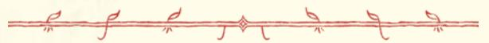

# **the marish**

The home of the Oldbuck family who famously migrated to the other side of the Brandywine river long ago, the Marish is a fenland that saw the first house-dwellers of the Shire. When they found it impossible to dig proper Hobbit-holes in the soggy ground of the region, the original settlers of the area started building farms, barns, and sheds above ground. This tradition continues to this day, and many farms dotting the area are stout buildings built of brick and with thatched roofs. The road traversing the Marish is peculiar in itself, as it is a causeway, a raised road built to carry travellers above the watery ground.

#### **RUSHEY**

The tiny hamlet of Rushey is one of the main settlements of the Marish, the other one being the larger village of Stock. Rushey stands upon a low hill, and houses a small number of families. The locals pride themselves on their harvests of cabbages and rhubarb, as well as their ability to draw bog iron from the surrounding swamps day and night — sometimes even working by lantern light. They trade their ore in Stock and the Bridgefields, and with the people of Deephallow, and even across the water in Buckland.

#### **PALE, COLD LIGHTS**

The Hobbits of Rushey aren't ones to speak of their troubles to outsiders. But in recent days, some of the locals have been reluctant to go into the surrounding marshlands in search of bog iron — especially after the sun goes down. Some fear has set upon them, and whispers of strange, scintillating lights that dance between the reeds and carry off wayward Hobbits into the marsh, never to return, are starting to be heard over drinks as far north as Stock and even over the Brandywine in Bucklebury.

Travellers who fail an **EXPLORE** roll while moving through the reeds and swamps around Rushey at night might encounter these flickering lights, and be drawn into a dreamy haze as they become completely lost in the marsh. Snapping out of it several hours later, they are overcome by an unnatural fear and must make a **VALOUR** roll to regain their composure before they can find their way back to safer ground.

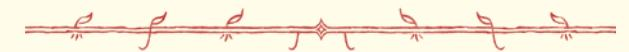

# **stock**

The town of Stock is certainly the busiest village in the Marish, if not the entire Southfarthing. It can be reached easily, by following the Stock Road out of Tuckborough, by slipping out of Woodhall following the Stock-brook, or simply by walking on the causeway. This bustling community is just as full of life as Hobbiton or Michel Delving, and has the best fish market

in all the Shire. Fresh catch can be found almost every day of the week, plucked right out of the Brandywine or the Stockbrook. But a good part of the popularity that Stock enjoys must be attributed to the Golden Perch, the inn known for the best beer served in the Eastfarthing (of no less repute is its plate of fish and chips). Here, it is not uncommon to find the occasional thirsty Took, who has come all the way from Tookland on a beer-tasting walk.

# **willowbottom**

Willowbottom lies at the southern edge of the Eastfarthing, in the deep valley cut by the Thistle Brook as it flows out of the Woody End. Populated by a handful of families boasting many fishermen and the occasional hunter and woodsman, Willowbottom is connected to Deephallow by means of an easterly road. The locals fish from the waters of the Thistle Brook and the near course of the Shirebourn, and hunt along the edges of the Woody End. They build simple wooden homes, and rarely venture outside their vicinity, except to trade with the Hobbits of Deephallow. It has been probably a century since someone from Willowbottom has ventured outside the Eastfarthing — at least that's what they say in Stock.

# **woody end**

Though this great upland forest of oaks and beeches, whitebeams and rowans, begins on the edges of Pincup in the Green Hills, its heart rests in the Eastfarthing. Here, foxes, badgers, and wild rabbits mingle with finches, starlings, and robins. From all the noise they make in the springtime among the great thicket of wood, one would suspect they are constantly gossiping with one another. It is not uncommon for Hobbits from the Yale to go on picnics along its edge. Indeed, the Stock Road from Tuckborough runs under its northern boughs on its eastward course, and both the River Shirebourn and the Thistle-Brook begin there before descending south. But apart from these infrequent intrusions, the Woody End can be considered to be sparsely populated at best, if not outright uninhabited. In autumn, the Woody End takes on a blazing golden hue, and the busy community of beasts and birds falls silent. By the time the first snows begin to fall, the hearth smoke trickling up from its eastern end leads travellers to the welcoming fires of Woodhall.

## **WOODHALL**

As one would suspect from the name, the village of Woodhall sits nestled in a tiny valley at the northeastern edge of the Woody End. It's a tiny community of woodsmen, hunters,

#### **THINGS TO DO IN STOCK**

Though not as prestigious as Michel Delving, or Hobbiton, Stock is quite a robust community. Player-heroes can find a surprising number of things to do given its large population, active community of fishermen, and the reputation of the Golden Perch that draws visitors from all the Four Farthings.

Visitors to Stock might find themselves drawn into one of its many regular fishing tournaments, enjoying a fine meal of fish and chips at the Golden Perch while they hear the latest tall tales out of Buckland and the Old Forest, or trading stories with a Dwarven traveller taking a break for the night. Player-heroes might be hired to carry a load of salted trout to Hobbiton or even as far as Michel Delving, or even tasked by a curious local with making an expedition to far off Bree to see if all the foolish tales from that town are true.

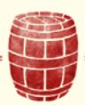

and farmers, enjoying the isolation and fresh air of their wild corner of the Shire. Despite the remoteness of the place, the local bilberry cake is a popular dish in the Eastfarthing, and is served as far away as the inns at Stock and Frogmorton.

A famous personality from Woodhall is the pipe-maker known as Old Rosefield, an artisan who has carved the finest briar smoking pipes in all the Shire for nearly seventy years. They fetch quite a good price on the rare occasion they appear in the markets of Whitfurrows. Although only a few people know it, in his house, Old Rosefield keeps an incredible collection of pipes he acquired from strange and foreign lands over the decades (in addition to a precious selection of those he has carved himself in his lifetime). Some of the older and most precious pieces are said to be of Dwarf-make, while another is even rumoured to have been crafted in a great Wizard's tower far to the south. Such strange creations must undoubtedly have equally strange enchantments upon them, and Rosefield is said to give them away to those who perform a great service to the people of Woodhall. On rare occasions, he will even trade them with those who offer a piece of fine craftsmanship in return.

#### **WANDERING ELVES**

Before Hobbits took root in the Shire, great forests covered the land, and Elves used to roam freely across the area. Today, one can meet them sometimes in the Woody End, as they wander on paths that are seldom trodden by Mortals.

The Loremaster can roll a Feat Die to determine whether or not the Player-heroes encounter such a traveller, should they find themselves beneath the eaves of the Woody End under bright-burning stars.

#### WOODY END ENCOUNTERS TABLE

| FEAT DIE ROLL  | RESULT                  | DESCRIPTION                                                                                                                                                                                                                                                                                                                                                  |
|-------------------|-------------------------|--------------------------------------------------------------------------------------------------------------------------------------------------------------------------------------------------------------------------------------------------------------------------------------------------------------------------------------------------------------|
| Image: [Red Rune] | An Unexpected Guest  | The Player-heroes have come upon a merry gathering of Elves and are invited to join them for an evening of fine food and lovely singing. They wake up the next morning filled with an invigorating zest (they each recover one point of Hope).                                                                                                         |
| 1–7               | No Encounter            | No special encounters are had.                                                                                                                                                                                                                                                                                                                               |
| 8                 | Sleeping Fairy          | A fox behaving curiously invites the Player-heroes to follow her. She leads them to what seems to be a fair Elf-maiden lying unconscious on the ground. If they help her with a HEALING roll, she wakes up, thanks them, and then disappears into the forest. From that moment on, when they are in the Woody End they never encounter bad weather. |
| 9                 | Dancing Stars           | Dancing lights dart to and fro in the Woody End, and a merry laughter is heard, as if someone were playing a prank. A tinkling of bells is heard, and then a warm breeze and the scent of flowers fills the air.                                                                                                                                       |
| 10                | Tales from the Trees | Hidden among trees, a few Elves call to Hobbits unknowingly passing by. After polite greetings, the Elves ask about the goings-on in the Shire before offering a tale of their people and proceeding on their journey.                                                                                                                                 |
| Image: [Red Eye]  | Wounded by Sorrow    | A sad Elf travels alone. He sees the Hobbits, smiles without mirth, then gazes to the stars and vanishes into the darkness. The sight of one so bright and beautiful laid low by the weight of the world's troubles leaves a stain on the heart of the Player-heroes, causing them to lose 1 Hope.                                                  |

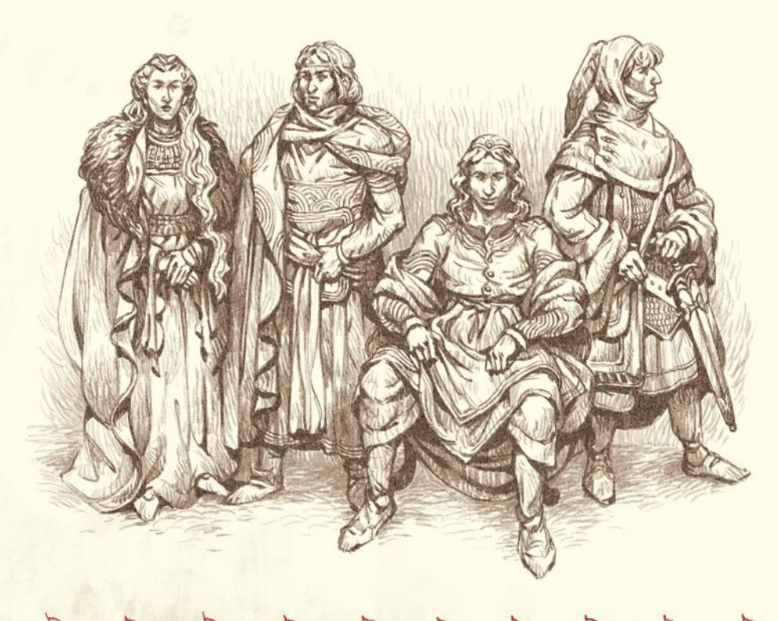

# **the yale**

The lowland region known as the Yale lies to the north of the Woody End and south of the Bridgefields district. The ancestral seat of the Boffin family, the Yale has no prominent village or township, but is instead dotted by many farms. For as long as any can recall, its inhabitants have tended fields of corn, cabbage, wheat, and many other crops. In recent generations, some among them have even taken to tending wandering flocks of sheep and keeping dairy cattle that nibble the grass of the long fields surrounding their homeland. This pleases the folk of the Eastfarthing to no end, and contributes to many a fine table kept in the region.

#### **THE BLACK WOLF OF WOODY END**

Children of the Yale are taught from an early age that if they're naughty they'll get more than a light supper. The worst punishment that any child in the Eastfarthing could possibly imagine is to be taken by the Black Wolf of Woody End. Locals say it is descended from one of the terrible beasts that came down during the Fell Winter. Now it lingers in the deepest part of the forest, watching for wayward children, and leaping out from the darkness to snatch them away and devour them.

With fur as black as night and eyes as red as fire, it only

comes out from its secret den at night to stalk its prey. It is said to have a particular fondness for Hobbit children, especially naughty ones — or so the gaffers and gammers say. Grown-ups know the Black Wolf to be nothing more than balderdash, but in recent years, adventurous souls who've gone off into the Woody End in search of Elves at sunset claim to have seen gleaming red eyes staring at them from the long shadows of the fading day. More than one child, and even a tween or two, has come running from the forest stammering and spluttering about a low, rumbling growl and the sight of a pair of fiery eyes

glowing in the darkness.

The hysteria has gotten to be a bit much for the people of the Yale and calls have rung out for a Bounder to make a proper investigation. The Bounders are not very inclined to investigate, and it may fall to more adventurous locals to get to the bottom of things.

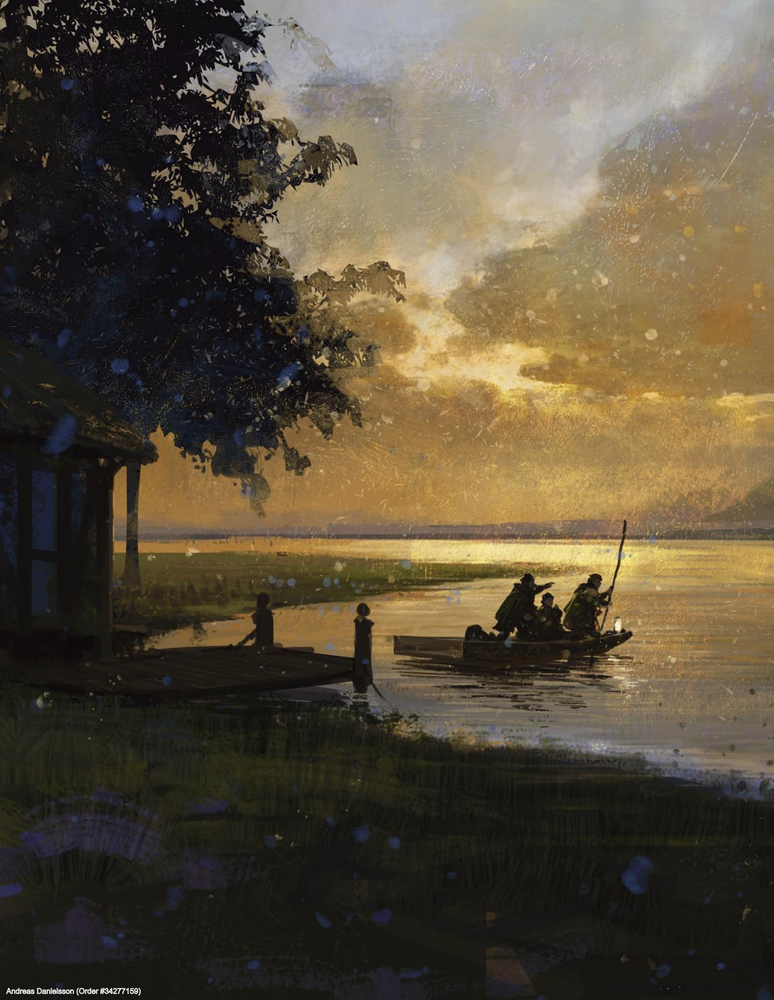

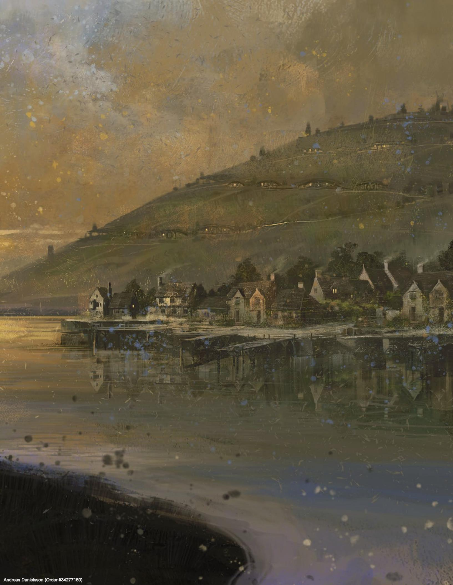

# buckland

*… a thickly inhabited strip between the river and the Old Forest, a sort of colony from the Shire. Its chief village was Bucklebury, clustering in the banks and slopes behind Brandy Hall.*

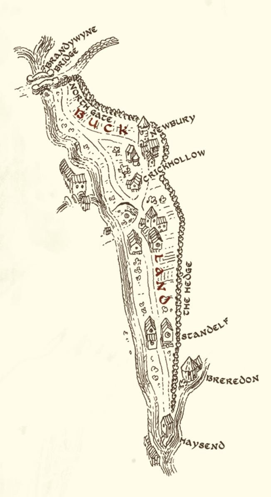

No Hobbit east of the Brandywine would dare be so outrageous as to call Buckland the fifth Farthing of the Shire, but by all reasonable conclusion that is what it is. It was founded over six hundred years ago, when Gorhendad Oldbuck decided the Shire was getting too crowded for his liking. The enterprising Hobbit took himself and his relations over the

Brandywine River and travelled almost to the edge of the Old Forest, where he stopped to set down stakes. He even went so far as to rename himself Gorhendad Brandybuck and built the great complex of smials we now call Brandy Hall.

These days, Buckland has a reputation for all kinds of oddities that range from river-boating and even river-swimming Hobbits, to legends that whisper of hateful trees that move on their own beyond the High Hay. Though they might seem strange to most Hobbits residing elsewhere, Bucklanders are a proper folk, after their own fashion.

# **bucklebury and brandy hall**

Bucklebury is quite a bustling little village, serving the heart of Buckland with its ferry. Brandybucks of all stripes and their closest kin live around here, fishing along the banks of the Brandywine, tending chickens, and growing crops like any other Hobbits. Buck Hill rises up at its very heart — it is a large mound covered in green grass and wildflowers in both spring and summer, and the seat of Brandy Hall, where the Master of Buckland rules over his numerous relations.

Regardless of the day or season, one hundred Brandybucks seem to be ever present, moving along the deep-delved tunnels of Brandy Hall, and there's always a collection of kinfolk setting to work on new passages and chambers to make more room for the growing family. As it is now, Brandy Hall has three large front doors, several secondary doors, and a hundred windows, all opening on the sides of Buck Hill. Each door is fitted with a stout lock, an enduring habit from the days of Buckland's founding as a protection against the dangers of the nearby Old Forest.

# **crickhollow**

The biggest news out of Buckland in recent years came last spring when a young gentlehobbit by the name of Rollo Boffin came all the way from the Westfarthing and built himself a small but homely house. For his new residence he chose Crickhollow, a pleasant corner a few miles north of Bucklebury. Taking little heed of the advice of locals, Rollo has built his home closer to the High Hay and the Old Forest than is considered proper, much to the consternation of his neighbours.

# **OLD BROADBELT**

The current Master of Buckland is Gorbadoc Brandybuck, or Old Broadbelt as he is known by many — on account of his ample waistline and his considerable age. He has shown his good character by serving as a shrewd and stout patriarch over both kin and land for fifty years now. In spite of his stiff demeanour, he's shown nothing but kindness to his own kin, even when his daughter Primula went and became engaged to Drogo Baggins out of Hobbiton. A gaffer's wisdom keeps him well aware of any mischief which his relations get up to, whether causing trouble or planning some foolish expedition into the Old Forest. Though he was once a tween himself, and loves to recount to his younger relations the stories of his days as a reckless youth, Gorbadoc is quick to undercut such tales with reminders that this mischievousness come at a cost, and one must always keep a keen eye and a sharp mind in all deeds.

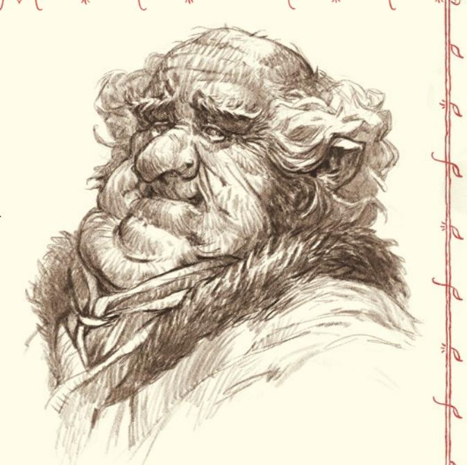

# **haysend**

A small village, little more than an outpost, stands at the southern edge of the High Hay, where the Withywindle flows out the Old Forest to join the Brandywine. Only the most hardened loners of Buckland live here, with the Old Forest almost at their doorsteps. Caught between the river bend and the trees, they constantly drive away curious visitors with their dour stories and cold demeanour. The folk of Haysend seem to have a particular dislike for the Hobbits of Deephallow, with whom they are always arguing over fishing rights and fair trading prices.

# **FISHING COMPETITION**

The disagreements between the Hobbits of Haysend and Deephallow over fishing rights may finally come to an end. The people of both villages have agreed to hold a fishing competition! Whoever wins will enjoy exclusive fishing rights over the tract of the Brandywine dividing the two settlements for one full year. Both villages will choose a fisherman champion — whoever pulls the most fish out of those coveted waters from dawn till dusk will be declared the winner.

But nothing is ever that simple when it comes to settling such disputes. Neither village trusts the other, so they're both in search of impartial judges for the contest. The folk of Deephallow don't trust anyone from Buckland, and the Haysend locals don't want any Shire-Hobbit.

The Player-heroes may find themselves in this unlucky role if they get drawn into local politics. Judging the competition will be an exercise in frustration, as members of both communities argue with one another over everything, from the proper bait, the exact time for sunrise and sunset, whether the winning boat should be determined by quantity or weight of the fish caught, or any other tiny detail they can think of. This can require any number of **AWARENESS**, **HUNTING**, or **INSIGHT** rolls, depending on what the character is judging, and no matter who ends up being the victor, the judges will surely be accused of having cheated or even having been bribed by the winners, and nothing will truly be settled!

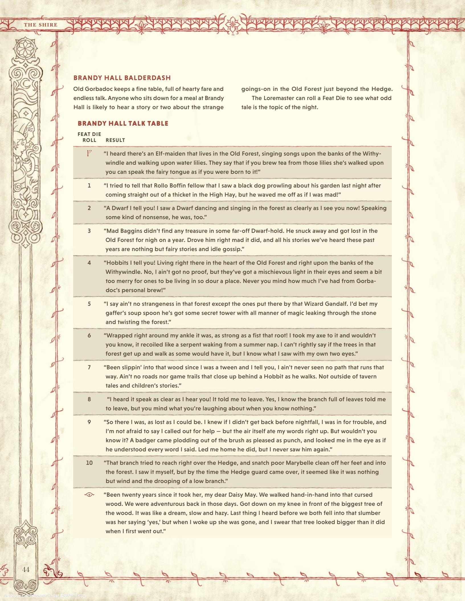

#### **BREREDON**

Often forgotten or even wilfully ignored by even the Hobbits of Buckland for their willingness to dwell beyond the High Hay, there is a tiny community of fishermen somewhere just beyond the Hedge inside the borders of Old Forest itself. Known as Breredon, it stands near a small landing on the Withywindle, protected by a barrier they call the Grindwall that extends into the water.

The folk of Breredon, when encountered at all by other Hobbits, are a fey lot even by Buckland standards. They

are prodigious smokers, and have a particular fondness for rhymes and riddles, which even they do not recall from where they learned — though these nonsense songs have been passed down for as long as any can remember and new ones even spring unbidden into the minds of Breredon Hobbit children from time to time. The Hobbits in Haysend claim to hear these merry and foolish songs coming up over the High Hay on warm summer nights — if you can pull such a tale out of those ill-tempered folks.

# **STRANGE SONGS**

Visitors staying the night in Haysend, or in Breredon itself, may get to hear one or two of the outlandish songs sung by those strange Old Forest dwellers.

The Loremaster can roll a Feat Die to see which songs are sung on such a night.

### BREREDON TALES TABLE

#### **FEAT DIE**

**ROLL RESULT**

- "Saw the golden lady I did, walking upon the Withy waters. As fair as morning dew she was, a River and her daughter."
  - 1 "Lights they dance, from Rushey to the Forests of Cardolan. Spirits in the Woodlands, Ghosts of Northern Kings of Man."
- 2 "Whisper not words and threats to Old Man Willow. Unless blue your jacket be, and your boots be yellow."
- 3 "Badger-Brock is a friend of mine! Treat him well, treat him kind!"
- 4 "Wandering dog, he's not returned! Blackened beast in bonfire burned!"
- 5 "Hear you not the song of the Master and his River-Wife? Take his gifted lilies or instead take strife!"
- 6 "Trespass, trespass, walker in the wood. Hateful trees, and harmful wood. Raise no axe and no secrets tell, lest you be forgotten, and you be felled."
- 7 "In the house, in the house the Master waits. Greet him kindly at his gates. Remain awake if you are able, until you sit at Orald's table!"
- 8 "Gold be the berry unplucked from the tree, dancing upon the lilies fairest among the free."
- 9 "Old songs are foolish, yes it's true. But such was power when the world was new."
- 10 "Blades in barrows, deathless kings entombed, Elf-Lord spoke Black Captain's doom."
- "Go not, go not, for trees remember! First to burn in blackened embers!"

# **the high hay**

The High Hay is a thick hedge rising thrice the height of a Hobbit, and running for the length of the eastern border of Buckland, almost ten leagues from the East Road in the North, to the village of Haysend in the south. If you listen to those living in Buckland, the High Hay is the true border of the Shire, a claim disputed only by those traditionalists who live west of the Brandywine. Three openings allow passage to the other side — the North Gate, leading to the East Road and guarded day and night, a private tunnel near Crickhollow used by members of the Brandybuck clan, and a southern gate opening in the vicinity of the village of Haysend.

Old lore holds that the Hedge (another name for the High Hay) was planted by order of Gorhendad Oldbuck upon the very day he claimed the surrounding land as his own. According to the stories, the trees of the Old Forest itself rose up in revolt years later, enraged at having a border forced upon them. They leaned over the Hedge, threatening to smash through it, and were driven back only when the Buckland Hobbits burnt hundreds of trees, feeding a bonfire that went on for days on end, gaining them the hostility of the Forest. A glade opens on the spot where that fire raged, as no trees will grow near it.

The Hobbits of Buckland maintain a constant vigilance over the High Hay. Guards armed with axes as well as flint and tinder walk its edge, planting fresh seeds and cutting away wayward vines to ensure that the Old Forest remains in its place.

# **newbury**

Nestled just a few miles north of Bucklebury and cradled along the edge of the Old Forest, the village of Newbury is considered a recent addition to the region, even if its foundation goes back to a time no one in Buckland can remember. With no Bounders crossing the Brandywine and the shadow of the Old Forest on their doorstep, many of the folk in

> Newbury keep a wary eye on the darkness when the night comes, tending to the Hedge and even making rare expeditions into the woodland proper. Still, they always return before nightfall, and there's never been a tale of one going without a proper bow and quiver along with their sturdy walking stick. More than one has even gone in with an axe at their belt!

> The locals that gather at Hugo's Gruff, a tiny local inn of comparatively poor quality to those found in the Shire, regularly hear tales of unnatural goings on in the Old Forest, and on windy autumn nights, many locals claim that they can hear baleful noises echoing up from over the High Hay.

# **standelf**

Standelf is found at the end of the road going south from Bucklebury. Built around a stone quarry that was abandoned long ago, the village is composed of ancient and sturdy stone houses with thatched roofs. The folk of Standelf carry on a good trade across the Brandywine with the Hobbits of Rushey, forging the bog iron harvested there into axes and other tools. In return, they keep that community well stocked with pork and wild berries, both of which are found in abundance in the village.

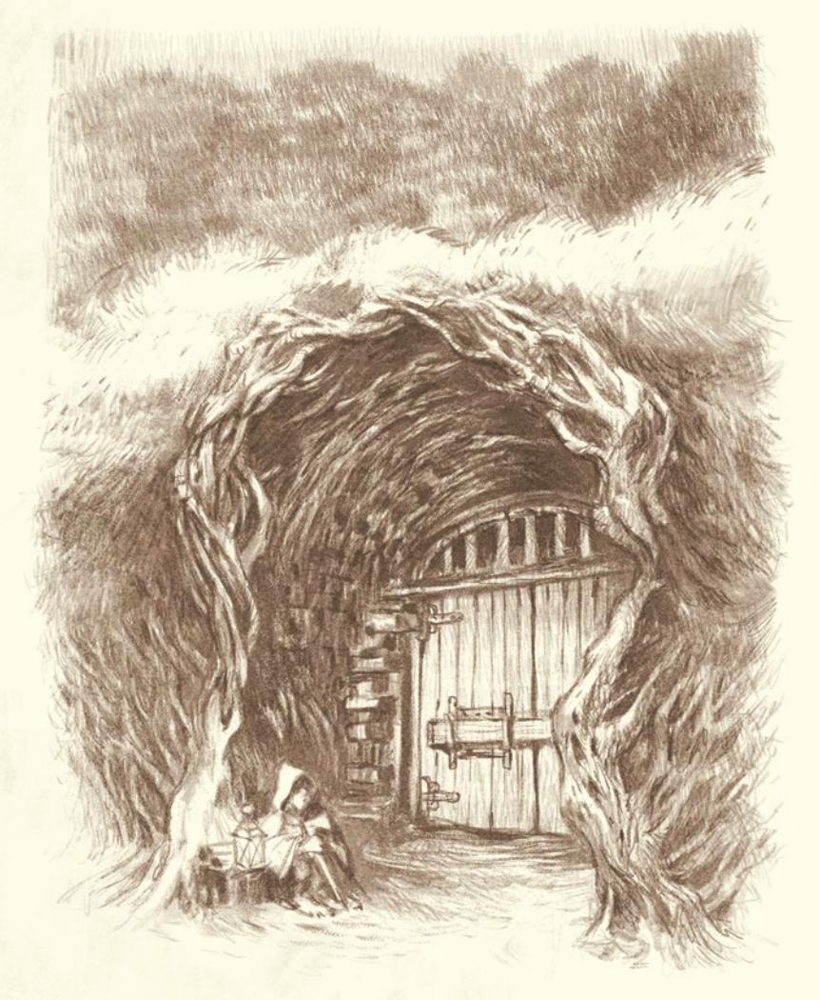

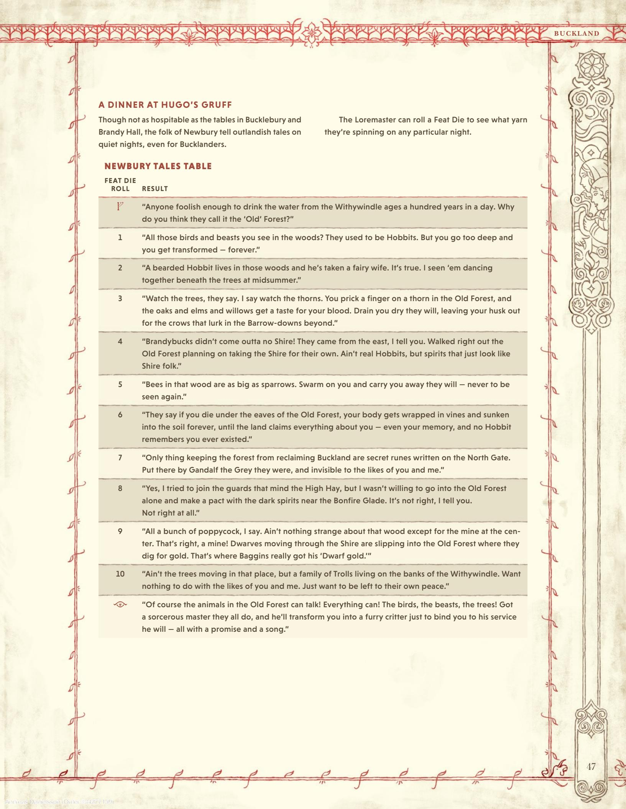

# the old forest

*It was not called the Old Forest without reason, for it was indeed ancient, a survivor of vast forgotten woods; and in it there lived yet, ageing no quicker than the hills, the fathers of the fathers of trees, remembering times when they were lords.*

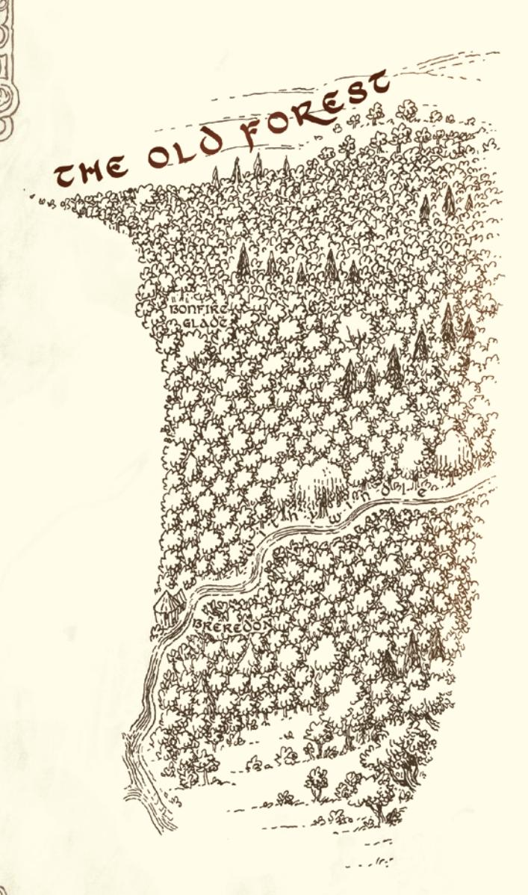

Not part of the Shire proper, even by the standards of the Bucklanders, the Old Forest warrants more than a bit of discussion, in spite of what proper Shire-Hobbits might claim. Unwillingly bordered on its western side by the Hedge, it runs clean over the Withywindle in the south before very nearly touching the dreaded Barrow-downs, farther from the Shire than any sensible Hobbit would dare to walk. Its northern end is visible to anyone crossing the Brandywine and making their way east to Bree. To the few Hobbits that dare to make such a journey, the road takes a northerly turn and moves further away from the shadowy eaves of the Old Forest as it goes.

Little is said of the Old Forest by folks in the Shire, and even less is believed. Many hold it to be extremely old, much more than its name would suggest. Trees that were ancient when Marcho and Blanco were young still grow there, and many tales claim that they offer naught but malice to any that dare to invade their domain. Particularly foolish tweens, reckless even by the standards of a Brandybuck, challenge each other to sneak beyond the High Hay and touch the closest tree within its borders. Even this game is only played on the brightest of summer days, and it is never a solitary endeavour.

All manner of queer tales find their origins in the Old Forest. From enchanted fairy maidens that use scented flowers to entrap foolish travellers, to the fearsome Master of the Forest capable of ordering the trees to rise from their roots and devour trespassers. Even the river that runs through the heart of the Old Forest, the Withywindle, is said to lull any who drink from its water into a magical slumber from which they will never awaken.

In the end, no Hobbit of any sense thinks too deeply about the truth of the Old Forest, let alone ventures within it. Even so, legends persist that there are some among the Shire-folk who dare to make such journeys in search of some secret wisdom, which they keep private from their fellows.

Andreas Danielsson (Order #34277159)

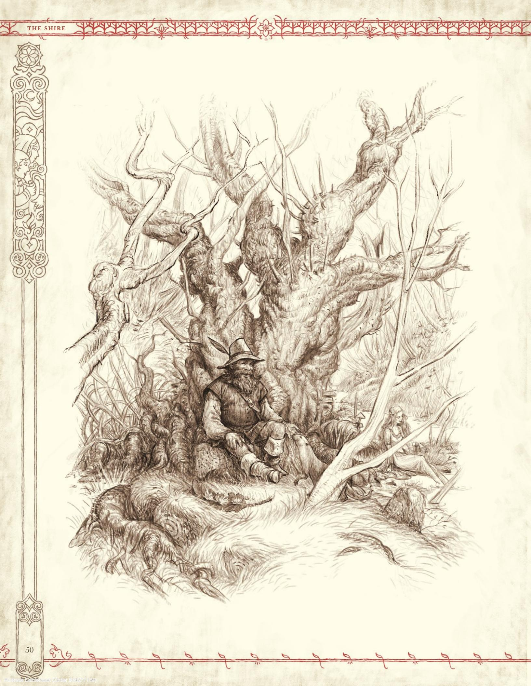

#### **TOM BOMBADIL, THE MASTER**

Tom Bombadil is a truly unknowable being. His simple, joyful existence is one spent in song, gathering tokens for his beloved wife Goldberry, and playing mischievous games with the woodland creatures. He walks with a merry step, singing songs that seem to be naught but nonsense. In spite of his lightness of heart, or perhaps because of it, no ill thing of the Old Forest can set itself against him. Indeed, there is no evil that has touched his heart, and his true nature is unknown, even to the Wise. He stands taller than a Hobbit, yet less so than a Man, and is clad in a blue jacket, great yellow boots, and sports a full beard as brown as the fertile soil upon which he dances.

It would be foolish to dismiss his strange songs as nonsense though, for Tom is as old as old, as wise as wise, and for all his merriment, has knowledge beyond measure. Whether it is the gladness in his heart that prevents any evil from threatening him or it is the nature of his spirit no one can say — Tom is the Master of the Old Forest, and unconcerned with affairs beyond his domain.

Should Player-heroes find themselves invited to stay by Tom Bombadil in his house, they will find their hearts lightened and their hope restored. They will be invited to feast and sing and tell tales to Tom and his beloved wife Goldberry in return for this hospitality.

Anyone acting in a respectful manner and joining Tom in this merry making can make a **SONG** roll. Those who pass recover 1 Hope, +1 for each icon rolled. In addition, if the characters brought with them any beasts of burden or hounds, those creatures will be blessed to remain keen of mind and stout of heart for the rest of their days. Such a creature will understand the verbal commands of their master. Finally, such a beast blessed by Bombadil will always be able to find their way back to Tom if they become lost in the Old Forest or Barrow-downs.

# **the house of tom bombadil**

Just beyond the Old Forest to the east, where the Withywindle runs down from its spring in the Barrow-downs, and known to few save those who were brought to it by the Master himself, is the warm and inviting House of Tom Bombadil. Found over a hill and under that same hill, those who are guided there and invited inside find comfort and lightened hearts beyond any they could imagine in the Old Forest. The grass nearby is shorn, and the forest is tended as if a garden or manicured hedge, and an easy path leads to the warm cabin of wood with golden light shining through the windows.

Those who take refuge here do so only by the will of Bombadil and at his invitation. Under his roof and at his table, they will find their heart contented with peaceful slumber, fine company, joyous song, and all the simple pleasures that come with a humble heart. Lamps hang, casting a warm light over a wooden table that is often laden with food, with a single empty chair set before it as if awaiting a woodland queen to take her proper seat.

Guests are welcomed with plates of berries and honey and given warm mattresses to sleep upon. They will find sleep comes easy, and none of the nightly noises will set fear into their hearts.

# **the withywindle**

This small dark river of brown water owes its name to the many ancient willows that border its banks, arch over it, and sometimes even block its course with fallen logs and thousands of faded willow-leaves. It gently flows from the uplands of the Barrow-downs to the east, into the Brandywine to the west, and crosses the entire width of the Old Forest. Mist clings to its banks on autumn mornings, and no Hobbits of Buckland or the Shire dares to set a boat into its waters, in spite of its easy flow. Only the Hobbits of Breredon keep a small landing from where they mostly cast rods for fishing.

The folk of Haysend claim the Withywindle belongs to no one, save the River-Daughter, whom they say to be as fair and beautiful as summer, and as elusive as a dream. They say that the occasional water lily that is seen floating along in its current is a sign of her presence, and should be taken as an omen of good luck. Some even believe that those who listen closely can hear her singing, though no one has ever seen her when these songs of soft joy are heard on spring winds.

#### **GOLDBERRY, THE RIVER-DAUGHTER**

Beautiful and calm, the elusive maiden some call Goldberry possesses an Elvish kind of beauty. She is an enchantment and a mystery to all whom she encounters. Golden-haired and clad in a dress of reeds and living flowers, she springs lightly as the wind upon the banks of the river. Singing with the natural beauty of a summer rain, she shares songs that raise the hearts of all who are blessed to hear her. She conceals herself well in the Old Forest, and though some believe her to be a river-spirit, no one knows her true nature — only that she is the lady of the Master, Tom Bombadil, and that he regularly dotes upon her by plucking water lilies from the banks of the Withywindle to present to her as token of his love.

The blessed few who hear the song of Goldberry the River-Daughter find their fear driven back, and all darkness seems far away. Hearts are lightened by the joy of her presence and the fairness of her voice, and those who hear her regain 1 point of Hope from the gift of such a song and a smile.

### **OLD MAN WILLOW**

Deep in the Old Forest, somewhere along the banks of the Withywindle, grows a great and twisted willow tree, gnarled and hoary, with its great branches hanging over the dark water and its roots drinking deep. Unlike the River-Daughter, it has a fearful reputation, and the Hobbits of Buckland speak of it only in whispers and fearful verses. Its grey and yellow leaves sway softly in the breeze, though there is an aura of ill-will that seems to radiate from its trunk. The few Bucklanders that have seen it say this tree is as old as the earth itself, while the Hobbits of Breredon believe it is a thirsty earth-bound spirit that has been imprisoned in the greatest willow of the Old Forest. Whatever the truth is, it is likely known to no one.

Old Man Willow, as he is named by the Master, is a hateful thing that sets his ill will towards any Hobbits or other interloping invaders of the Old Forest. His swaying leaves put a spell on all those who see them or hear their rustle, setting weariness in their body until all they wish to do is lean against his trunk and surrender to the foul enchantment. Once asleep, under those shading branches and with their back against that gnarled bark, Old Man Willow opens his roots. The slumbering traveller falls in and is never seen again.

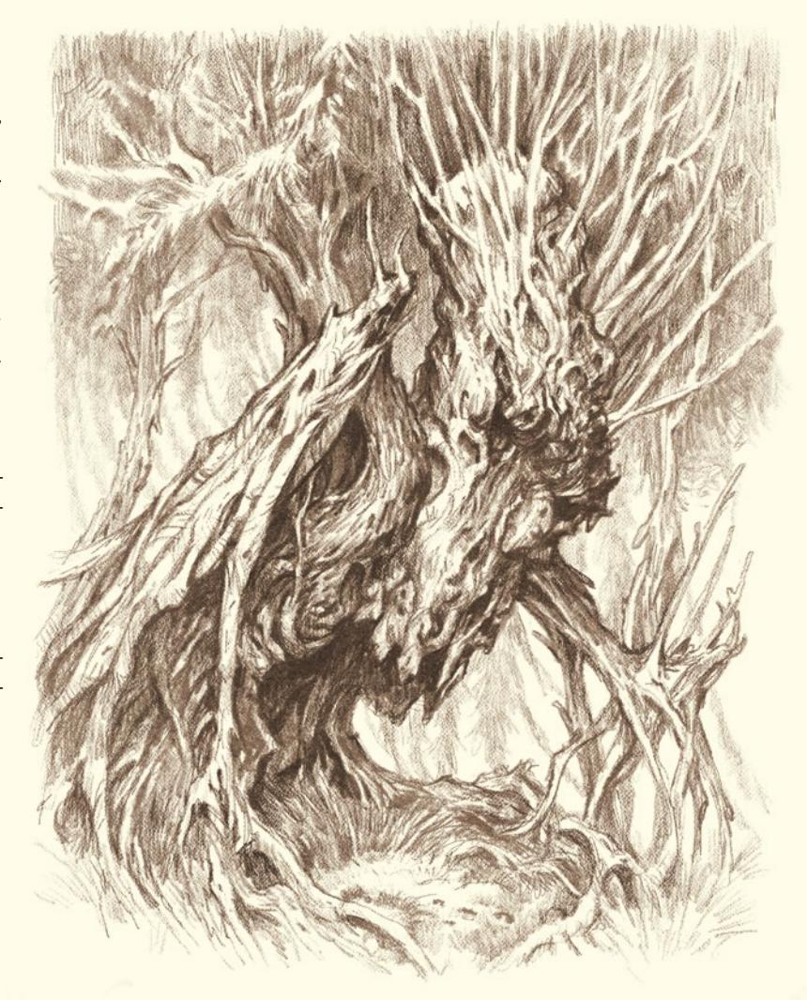

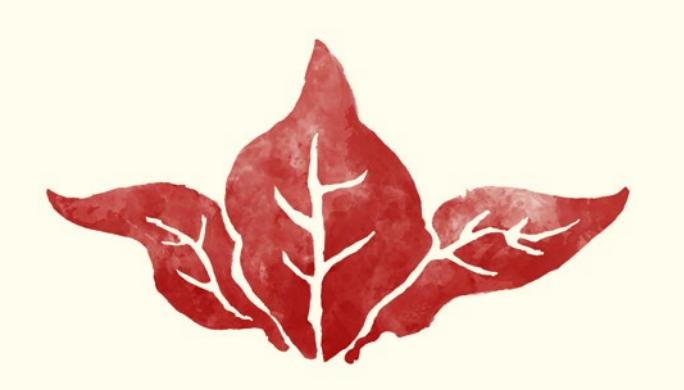

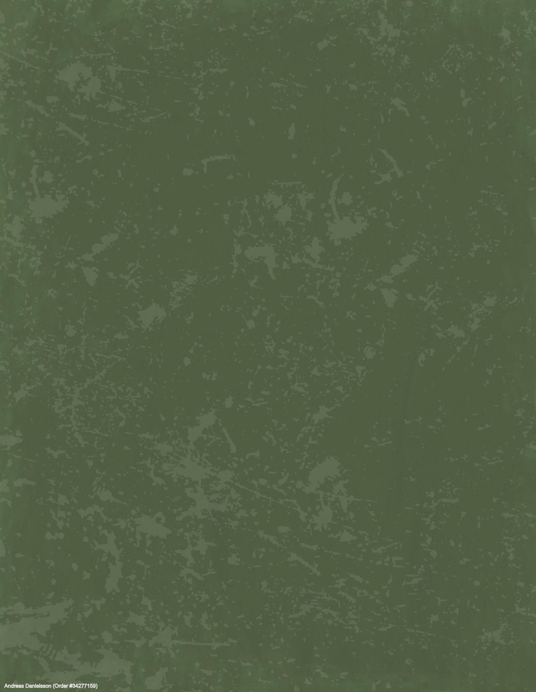